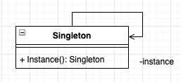
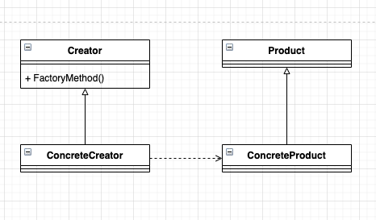
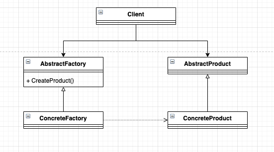
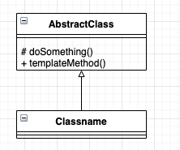
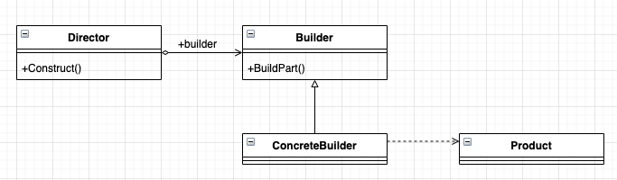
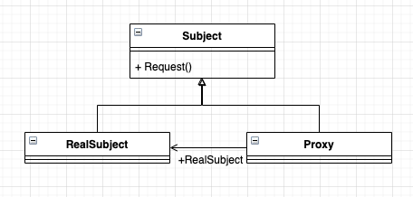
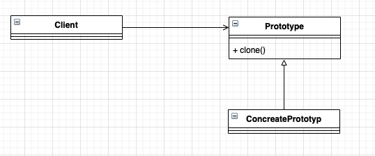
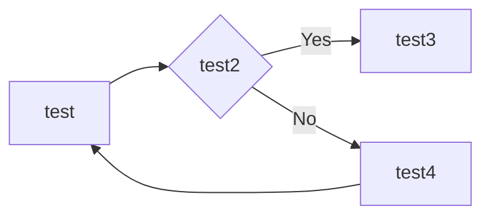

# design-pattern-for-ts
design pattern for typescript

## [单例模式(Singleton Pattern)](./src/1.singleton-pattern)

> 创造类

> Ensure a class has only one instance, and provide a global point of access to it.（确保某一个类只有一个实例，而且自行实例化并向整个系统提供这个实例。）

## [工厂方法模式(Factory Method Pattern)](./src/2.factory-method-pattern)

> 创造类

> Define an interface for creating an object, bug let subclasses decide which class to instantiate. Factory Method lets a class defer instantiation to subclasses （定义一个用于创建对象的接口，让子类决定实例化哪一个类。工厂方法使一个类的实例化延迟到其子类。）

## [抽象工厂模式(Abstract Factory Pattern)](./src/3.abstract-factory-pattern)

> 创造类

> Provide an interface for creating families of related of dependent objects without specifying their concrete classes. (为创建一组相关或相互依赖的对象提供一个接口，而且无需指定它们的具体类)

## [模板方法模式(Template Method Pattern)](./src/4.template-method-pattern)

>行为类

> Define the skeleton of an algorithm in an operation， deferring some steps to subclasses. Template Method lets subclasses redefine certain steps of an algorithm without changing the algorithm's structure.（定义一个操作中的算法的结构，而将一些步骤延迟到子类中。使得子类可以不改变一个算法的结构即可重定义该算法的某些特定步骤。）

## [建造者模式(Builder Pattern)](./src/5.builder-pattern)

> 创造类

> Separate the construction of a complex object from its representation so that the same construction process can create different representations.（将一个复杂对象的构建与它的表示分离，使得同样的构建过程可以创建不同的表示。）

## [代理模式(Proxy Pattern)](./src/6.proxy-pattern)

> 结构类

> Provide a surrogate or placeholder for another object to control access to it. （为其他对象提供一种代理以控制对这个对象的访问）

## [原型模式(Prototype Pattern)](./src/7.prototype-pattern)

> 创造类

> Specify the kinds of objects to create using a prototypical instance，and create new objects by coping this prototype. （用原型实例指定创建对象的种类，并且通过拷贝这些原型创建新的对象。）

## [中介者模式(Mediator Pattern)]()

## [命令模式(Command Pattern)]()

## [责任链模式(Chain of Responsibility Pattern)]()

## [装饰模式(Decorator Pattern)]()

## [策略模式(Strategy Pattern)]()

## [适配器模式(Adapter Pattern)]()

## [迭代模式(Iterator Pattern)]()

## [组合模式(Composite Pattern)]()

## [观察者模式(Observer Pattern)]()

## [门面模式(Facade Pattern)]()

## [备忘录模式(Memento Pattern)]()

## [访问者模式(Visitor Pattern)]()

## [状态模式(State Pattern)]()

## [解释器模式(Interpreter Pattern)]()

## [亨元模式(Flyweight Pattern)]()

## [桥梁模式(Bridge Pattern)]()

