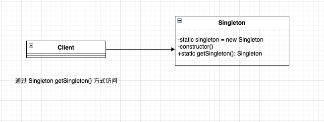

# 单例模式（Singleton pattern）


## 我是皇帝我独苗

自从秦始皇确立了皇帝这个位置以后，同一时期基本上就只有一个人孤零零地坐在这个位置。这种情况下臣民也好处理，大家叩拜、谈论的时候只要提及皇帝，每个人都知道指的是谁，而不用再皇帝前面加上特定的称呼，如张皇帝、李皇帝。这有个过程反应到设计领域就是，要求一个类只能生成一个对象（皇帝），所有对象对它的依赖都是相同的，因为只有一个对象，大家对它的脾气和习性都非常了解，建立健壮稳固的关系，我们把皇帝这种特殊职业通过程序来实现。

皇帝每天要上朝接待臣子、处理政务，陈梓每天要叩拜皇帝，皇帝智能有一个，也就是一个类只能产生一个对象，该怎么实现呢？对象产生是通过 new 关键字完成的（当然也有其他方式，比如对象复制`clone`、反射`eval`）,这个怎么控制呀，但是大家别忘记了构造函数，使用new关键字创建对象时，都会根据输入的参数调用相应的构造函数，如果我们把构造函数设置为private私有访问权限币就可以禁止外埠创建对象了吗？臣子叩拜唯一皇帝的过程类图如图所示。


只有两个类， `Emperor` 代表皇帝类, `Minister` 代表臣子类，关联到皇帝类非常简单

```typescript
class Emperor {
    private static emperor: Emperor;
    private constructor() {
    }
    // static 会将他挂载到类上  而不是实例上
    static getInstance() {
        this.emperor = new Emperor();
        return this.emperor;
    }
    say() {
        console.log(`爱卿平身`);
    }
}
```

通过定义一个私有访问权限的构造函数，避免被其他类 **new** 出来一个对象，而 `Emperor` 自己则可以 **new** 一个对象出来，其他类对该类的访问权限都可以通过 `getInstance` 获得同一个对象。

皇帝有了，臣子要出场了

```typescript
class Minister {
    constructor(name: string) {
        // 面见圣上
        const emperor = Emperor.getInstance();
        console.log(`臣 ${name},拜见陛下,吾皇万岁万岁万万岁`);
        emperor.say();
    }
}
```

分别有3个臣子拜见皇帝

```typescript
const minister1 = new Minister('王钢蛋');
const minister2 = new Minister('张铁锤');
const minister3 = new Minister('赵四');
```

运行结果如下

```shell
臣 王钢蛋,拜见陛下,吾皇万岁万岁万万岁
爱卿平身
臣 张铁锤,拜见陛下,吾皇万岁万岁万万岁
爱卿平身
臣 赵四,拜见陛下,吾皇万岁万岁万万岁  
爱卿平身
```

臣子天天要上朝参见皇帝，今天拜见的皇帝应该和昨天、前天的一样（过渡期的不考虑，别杠），大臣磕完头，抬头一看，嗨，还是昨天那个皇帝，老熟人了，容易讲话，这就是单例模式。

## 单例模式的定义

单例模式（**Singleton Pattern**）是一个比较简单的模式，其定义如下：

Ensure a class has only one instance, and provide a global point of access to it.（确保某一个类只有一个实例，而且自行实例化并向整个系统提供这个实例。）

单例模式的通用类图



Singleton 类称为单例类，通过使用 private 的构造函数确保了在一个应用中只产生一个实例，并且是自行实例化的 （在 Singleton 中自己使用 new Singleton()）。单例模式的通用源码如下

```typescript
class Singleton {
    private static singleton = new Singleton();
    // 限制产生多个对象
    private constructor() {
    }
    // 通过该方法获得实例对象
    static getSingleton(): Singleton {
        return this.singleton;
    }
    // 类中其他方法，尽量是 static
    static doSomething(): void {
        // 其他逻辑
    }
}
```


## 单例模式的应用


### 单例模式的优点

- 由于单例模式在内存中只有一个实例，减少了内存开支，特别是一个对象需要频繁地创建、销毁时，而且创建或销毁时性能又无法优化，单例模式的优势就非常明显。

- 由于单例模式只生成一个实例，所以减少了系统的性能开销，当一个对象的产生需要比较多的资源时，如读取配置、产生其他依赖对象时，则可以通过在应用启动时直接产生一个单例对象，然后用永久驻留内存的方式来解决（在采用单例模式时需要注意垃圾回收机制）。Java - JVM ， Node - V8

- 单例模式可以避免对资源的多重占用，例如一个写文件动作，由于只有一个实例存在内存中，避免对同一个资源文件的同时写操作。

- 单例模式可以在系统设置全局的访问点，优化和共享资源访问，例如可以设计一个单例类，负责所有数据表的映射处理；或者状态管理。

### 单例模式的缺点

- 单例模式一般没有接口，扩展很困难，若要扩展，除了修改代码基本上没有第二种途径可以实现。单例模式为什么不能增加接口呢？因为接口对单例模式是没有任何意义的，它要求 “自动实例化”，并且提供单一实例、接口或抽象类是不可能被实例化的。当然，在特殊情况下，单例模式可以实现接口、被继承等，需要在开发中根据环境判断。
- 单例模式对测试是不利的。在并行开发环境中，如果单例模式没有完成，是不能进行测试的，没有接口也不能使用mock的方式虚拟一个对象。
- 单例模式与单一职责原则有冲突。一个类应该只实现一个逻辑，二不关心它是否是单例的，是不是要单例取决于环境，单例模式把 ”要单例“ 和业务逻辑融合在一个类中

### 单例模式的使用场景

在一个系统中，要求一个类有且仅有一个对象，如果出现多个对象就会出现 “不良反应” 可以采用单例模式，具体场景如下：

- 要求生成唯一序列号的环境；
- 在整个项目中需要一个共享访问点活共享数据，例如状态管理，可以不用把每次刷新都记录到数据库中，使用单例模式保持变量的值；
- 创建一个对象需要消耗的资源过多，如要访问IO和数据库等资源；
- 需要定义大量的静态常量和静态方法（如工具类）的环境，可以采用单例模式（当然，也可以直接声明为 static 的方式）。

### 单例模式的注意事项

首先，在高并发的情况下，请注意单例模式的线程同步问题（node忽略）。单例模式有几种不同的实现方式，上面的例子不会出现产生多个实例的情况

由于node属于单线程，所以几乎不会出现线程不安全的情况

```typescript
class Singleton {
    private static singleton: Singleton;
    // 限制产生多个对象
    private constructor() {
    }
    // 通过该方法获得实例对象
    static getSingleton(): Singleton {
        if (!this.singleton) {
            this.singleton = new Singleton();
        }
        return this.singleton;
    }
    // 类中其他方法，尽量是 static
    static doSomething(): void {
        // 其他逻辑
    }
}
```

但是在Java中，该单例模式在低并发的情况下上不会出现问题，若系统压力增大，并发量增加时则可能在内存中出现多个实例，破坏了最初的预期。为什么会出现这种情况呢？如一个线程A执行到 singleton = new Singleton（），但还没有获得对象（对象初始化是需要时间的），第二个线程B也在执行，执行到 ( singleton ) 的判断，那么线程B获得判断条件也为真，于是继续运行下去，线程A获得了一个对象，线程B也获得了一个对象，在内存中就会出现两个对象！线程不安全以及解决方式的将不赘述了，都是针对Java的，node以及前端可以暂时忽略。

## 单例模式的扩展

既然有单例模式，那从单例模式中，就能扩展出多例模式。

如果一个类可以产生多个对象，对象的数量不受限制，则非常容易实现，直接使用 new 关键字就可以了，如果只需要一个对象，使用单例模式就可以了，但是如果要求一个类只能产生两三个对象呢？我们还以皇帝为例来说明。直接上代码吧：

```typescript
class Emperor {
        // 每个皇帝都有名字，使用一个 数组 来容纳，每个对象的私有属性
        private static nameList: string[] = [];
        // 定义一个列表，容纳所有的皇帝实例
        private static emperorList: Emperor[] = [];
        // 当前皇帝的索引序号
        private static countNumOfEmperor = 0;
        // 产生所有的对象
        static {
            console.log(this.emperorList);
            this.emperorList.push(new Emperor('太上皇'));
            this.emperorList.push(new Emperor('皇帝'));
        }
        // 传入皇帝的名称，简历一个皇帝对象
        private constructor(name: string) {
            Emperor.nameList.push(name)
        }
        // 随机获取一个皇帝对象
        static getInstance(): Emperor {
            const random = Math.random();
            this.countNumOfEmperor = random < 0.5 ? 0 : 1;
            return this.emperorList[this.countNumOfEmperor];
        }
        // 皇帝发话了
        public static say(): void {
            console.log(this.nameList[this.countNumOfEmperor])
        }
    }
```

在 `Emperor` 中使用了两个数组分别存储实例和实例变量。

```typescript
class Minister {
    public static main(): void {
        //
        const ministerNum = 5;
        for (let i = 0; i < ministerNum; i++) {
            const emperor = Emperor.getInstance();
            console.log(`第${i}个大臣拜见的是：`)
            // emperor.say();
            Emperor.say();
        }
    }
}

Minister.main();
```

大臣惨败皇帝的过结果如下：

```shell
第0个大臣拜见的是：
太上皇
第1个大臣拜见的是：
皇帝
第2个大臣拜见的是：
太上皇
第3个大臣拜见的是：
太上皇
第4个大臣拜见的是：
太上皇
```

果然，每个大臣惨败的皇帝都可能不一样，大臣们就开始糊涂了，A 大臣给 皇帝 汇报了一件事情， 太上皇 不知道，然后就开始怀疑大臣 A 是皇帝的亲信，然后就开始整...

这种需要生产固定数量对象的模式就叫做有上限的多例模式，它是单例模式的一种扩展，采用有上限的多例模式，我们可以在设计时决定在内存中有多少个实例，方便系统进行扩展，修正单例可能存在的性能问题，提供系统的响应速度。例如读取文件，我们可以在系统启动是完成初始化工作，在内存中启动固定数量的 reader 实例，然后在需要读取文件时就可以快速响应。


## 单例模式在前端的应用

状态管理，相信大家都听说过，或者说接触过，现在用单例模式做一个建议的 store ，还是以大臣拜见皇帝为例


```typescript
// 皇帝类
class Emperor {
    private static emperor: Emperor;
    private count: number = 0;
    private constructor() {
    }
    // static 会将他挂载到类上  而不是实例上
    static getInstance(): Emperor {
        if (!this.emperor) {
            this.emperor = new Emperor();
        }
        return this.emperor;
    }

    say(): void {
        console.log(`爱卿平身`);
    }

    see(): void {
        this.count++;
        console.log(` 你是朕见过的第${this.count}个臣子, 退下吧`);
    }
}
// 臣子类
class Minister {
    emperor: Emperor;
    constructor(private name: string) {
        // 确定臣子的第一件事就是知道皇帝是谁
        this.emperor = Emperor.getInstance();
    }

    // 面见圣上
    formalVisit(): void {
        console.log(`臣 ${this.name},拜见陛下,吾皇万岁万岁万万岁`);
        this.emperor.say();
        this.emperor.see();
    }
}

// 臣子实例化
const minister1 = new Minister('王钢蛋');
const minister2 = new Minister('张铁锤');
const minister3 = new Minister('赵四');

// 三位臣子分批次面见皇帝
minister1.formalVisit();
minister3.formalVisit();
minister2.formalVisit();
```

- 结果

```shell
臣 王钢蛋,拜见陛下,吾皇万岁万岁万万岁
爱卿平身
你是朕见过的第1个臣子
臣 赵四,拜见陛下,吾皇万岁万岁万万岁  
爱卿平身
你是朕见过的第2个臣子
臣 张铁锤,拜见陛下,吾皇万岁万岁万万岁
爱卿平身
你是朕见过的第3个臣子

```


## 小结

单例模式是 23 个设计模式中比较简单的模式，应用也非常广泛。

