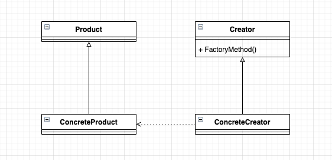
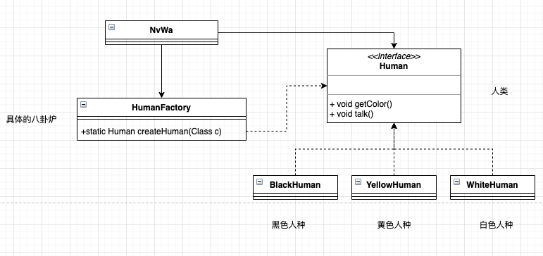
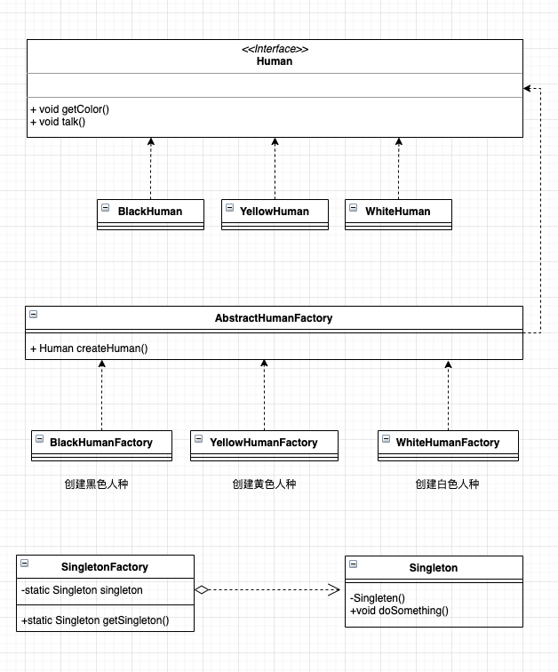

# 工厂方法模式（Factory Method）


## 女娲造人的故事

东汉《风俗通》记录了一则神话故事：“开天辟地，未有人民，女娲博黄土做人”，讲述的内容就是大家非常熟悉的女娲造人的故事。开天辟地之初，大地上并没有生物，只有苍茫大地，纯粹而洁净的自然环境，寂静而又寂寞，于是女娲决定创造一个新物种（即人类）来增加世界的繁荣，怎么制造呢？

别忘了女娲是神仙，没有办不到的事情，造人的过程就是这样的：首先，女娲采集黄土捏成人的形状，然后放到八卦炉中烧制，最后放置到大地上生长，工艺过程是没有错的，但是意外随时都会发生：

> 第一次烤泥人，感觉应该熟了，往大地上一放，哇，没烤熟！于是一个白人诞生了！（这也是缺乏经验的最好证明。）

> 第二次烤泥人，上一次没烤熟，这次多烤一会儿，放到世间一看，嘿，熟过头了，于是黑人诞生了！

> 第三次烤泥人，一边烧制一边查看，直到表皮微黄，嘿，刚刚好，于是黄种人诞生了！

这个造人过程是比较有意思的，是不是可以通过软件开发来实现这个过程？在面向对象的思维中，万物皆对象，是对象我们就是可以通过软件设计来实现。首先对造人过程进行分析，该过程涉及三个对象：女娲、八卦炉、三种不同肤色的人。女娲可以通过使用场景类Client来表示，八卦炉类似于一个工厂，负责制造生产产品（即人类），三种不同肤色的人，他们都是同一个接口下的不同实现类，都是人嘛，只是肤色、语言不同，对于八卦炉来说都是它生产出的产品。分析完毕，我们可以画出类图。


类图比较简单，AbstractHumanFactory是一个抽象类，定义了一个八卦炉具有的整体功能，HumanFactory为实现类，完成具体的任务——创建人类；Human接口是人类的总称，其三个实现类分别为三类人中；NvWa 类是一个场景类，负责模拟这个场景，执行相关的任务。

我们定义的每个人种都有两个方法：getColor（获得人的皮肤颜色）和talk（交谈），由于 **TypeScript** 不像JAVA，没有直接获取类的方法 `.class` ,不能直接把类当做实参，所以这里需要加一个方法用来返回,(或者可以通过传递实参来通过 `elseif` 来进行实例返回)， 其源代码如下：

人类总称

```typescript
interface Human {
    // 每个人种的皮肤都有相应的颜色
    getColor(): void;
    // 人类会说话
    say(): void;
}
```

接口 Human 是对人类的总称，每个人种都至少具有两个方法，黑色人种、黄色人种、白色人种的代码分别如下：

```typescript
// 黑色人种
class BlackHuman  implements Human {
    getColor(): void {
        console.log(`黑色人种的皮肤颜色是黑色的！`);
    }

    say(): void {
        console.log(`黑人会说话, 一般人听不懂`);
    }

    static newInstance(): BlackHuman {
        return new BlackHuman();
    }
}

// 黄色人种
class YellowHuman implements Human {
    getColor(): void {
        console.log(`黄色人种的皮肤颜色是黄色的！`);
    }

    say(): void {
        console.log(`黄色人种会说话，一般说的都是双字节`);
    }
    static newInstance(): YellowHuman {
        return new YellowHuman();
    }
}

// 白色人种
class WhiteHuman implements Human {
    getColor(): void {
        console.log(`白色人种的皮肤颜色是白色的！`);
    }

    say(): void {
        console.log(`白色人种会说话，一般说的都是单字节`);
    }
    static newInstance(): WhiteHuman {
        return new WhiteHuman();
    }
}
```

所有的人种定义完毕，下一步就是定义一个八卦炉，然后烧制人类。我们想象一下，女娲最可能给八卦炉下达什么命令？应该是“给我生产出一个黄色人种 `YellowHuman类`”，而不是“给我生产一个会走、会走、会跑、会说话、皮肤是黄色的人种”，因为这样的命令增加了交流的成本，作为一个生产的管理者，只要知道生产什么就可以了，而不需要事物的具体信息。通过分析，我们发现八卦炉生产人类的方法输入参数类型应该是Human接口的实现类，这也解释了为什么类图上的 `AbstractHumanFactory` 抽象类中 createHuman 方法的参数为 Class 类型。

```typescript
// 抽象人类创建工厂
abstract class AbstractHumanFactory{
    abstract createHuman<T extends Human>(c: T): T;
}
```

> 注意，我们这里采用了泛型，通过定义反省对 `createHuman` 的输入参数产生限制：
>
> - 必须是 Human 的实现类

```typescript
class HumanFactory extends AbstractHumanFactory {
    // 这里形参定义为字符串类型, 通过 elseif 进行判断，来返回实例
    // createHuman(type: humanType): Human {
    //     if (type === 'white') {
    //         return new WhiteHuman();
    //     } else if (type === 'black') {
    //         return new BlackHuman();
    //     } else if (type === 'yellow') {
    //         return new YellowHuman();
    //     } else {
    //         return new YellowHuman();
    //     }
    // }
    createHuman<T extends Human>(c: T): T {
        return c;
    }
}
```

人种有了，八卦炉也有了，剩下的工作就是女娲残疾黄土，然后命令八卦炉开始生产：

```typescript
class NvWa {
    static main(): void {
        // 声明阴阳八卦炉
        const magicFurnace = new HumanFactory();
        // 女娃第一次造人，火候不足，于是白人产生了
        console.log("--造出的第一批人是白色人种--")
        const white = magicFurnace.createHuman(WhiteHuman.newInstance());
        white.getColor()
        white.say();
        // 女娲第二次造人，火候国足，于是黑人产生了
        console.log("--造出的第一批人是黑色人种--")
        const black = magicFurnace.createHuman(BlackHuman.newInstance());
        black.getColor();
        black.say();
        // 第三次造人，火候刚刚好，于是黄色人种产生了
        console.log("--造出的第一批人是黄色人种--")
        const yellow = magicFurnace.createHuman(YellowHuman.newInstance());
        yellow.getColor();
        yellow.say();
    }
}

NvWa.main();
```

人种有了，八卦炉有了，负责生产的女娲也有了，激动人心的时刻到来了，结果如下：

```shell
--造出的第一批人是白色人种--
白色人种的皮肤颜色是白色的！      
白色人种会说话，一般说的都是单字节
--造出的第一批人是黑色人种--      
黑色人种的皮肤颜色是黑色的！      
黑人会说话, 一般人听不懂
--造出的第一批人是黄色人种--      
黄色人种的皮肤颜色是黄色的！      
黄色人种会说话，一般说的都是双字节
```

人类的生产过程就展现出来了！

## 工厂方法模式的定义

工厂方法模式使用的频率非常高，在我们日常的开发中总能见到它的身影。其定义为：**Define an interface for creating an object, bug let subclasses decide which class to instantiate. Factory Method lets a class defer instantiation to subclasses** （定义一个用于创建对象的接口，让子类决定实例化哪一个类。工厂方法使一个类的实例化延迟到其子类。）



 

在工厂方法模式中，抽象产品类 Product 负责定义产品的共性，实现对事物最抽象的定义；**Creator ** 为抽象创建类，也就是抽象工厂，具体如何创建产品类是由具体的实现工厂 **ConcreteCreator** 完成的。


```typescript
// 抽象产品类
abstract class Product {
    // 产品类公共方法
    public method1():void {
        // 业务逻辑
    }

    public abstract method2():void;

}

// 具体产品类
class ConcreteProduct1 extends Product {
    method2(): void {
    }
    static newInstance(): Product {
        return new ConcreteProduct1();
    }
}

class ConcreteProduct2 extends Product {
    method2(): void {
    }
    static newInstance(): Product {
        return new ConcreteProduct2();
    }
}

// 抽象工厂类
abstract class Creator {
    abstract createProduct<T extends Product>(c: T): T;
}

// 具体工厂类
class ConcreteCreator extends Creator {
    createProduct<T extends Product>(c: T): T {
        return c
    }
}

// 场景类
class Client {
    static main(): void {
        const creator = new ConcreteCreator();
        const product = creator.createProduct(ConcreteProduct1.newInstance());
        /**
         * 继续业务处理
         */
    }
}
```


## 工厂方法模式的应用


### 工厂方法模式的优点

首先，良好的封装性，代码结构清晰。一个对象创建是有条件约束的如一个调用者需要一个具体的产品对象，只要知道这个产品的类名（或约束字符串）就可以了，不用知道创建对象的艰辛过程，降低模块间的耦合。

其次，工厂方法模式的扩展性非常优秀。在增加产品类的情况下，只要适当地修改具体的工厂类或扩展一个工厂类，就可以完成“拥抱变化”。例如在我们的例子中，需要增加一个棕色人种，则只需要增加一个 `BrownHuman` 类，工厂类不用任何修改就可以完成系统扩展。

再次，屏蔽产品类。这一特点非常重要，产品类的实现如何变化，调用者都不需要关心，它只需关心产品的接口，只要接口保持不变，系统中的上层模块不要发生变化。因为类的实例化工作是由工厂类负责的，一个产品对象具体由哪一个产品生成是由工厂类决定的。

最后，工厂方法模式是典型的接口框架。高层模块值需要知道产品的抽象类，其他的实现类都不用关心，符合迪米特法则，我不需要的就不要去交流；也符合依赖倒置原则，只依赖产品类的抽象；当然也符合里氏替换原则，使用产品子类替换产品父类，没问题！


### 工厂方法模式的使用场景

首先，工厂方法是 new 一个对象的替代品，所以在所有需要声称对象的地方都可以使用，但是需要慎重地考虑是否增加一个工厂类进行管理，增加代码的复杂度。

其次，需要灵活地、可扩展的框架时，可以考虑采用工厂方法模式。万物皆对象，那万物也就皆产品类，例如需要设计一个连续邮件服务器的框架，有三种网络协议可供选择： POP3、IMAP、HTTP，我们就可以把这三种作为产品类，定义一个接口如 IConnectMail，然后定义对邮件的操作方法，用不同的方法实现三个具体的产品类（也就是连接方式）再定义一个工厂方法，按照不同的传入条件，选择不同的连接方式。如此涉及，可以做到完美的扩展，如某些邮件服务器提供了 WebService 接口，很好，我们只要增加一个产品类就可以了。

最后，可以使用在测试驱动开发的框架下。例如，测试一个类A，就需要把与类A有关联关系的类B也同时产生出来，我们可以使用工厂方法模式把类B虚拟出来，避免类A与类B的耦合。


## 工厂方法模式的扩展

工厂方法模式有很多扩展，而且与其他模式结合使用威力更大，下面将介绍4中扩展。

#### 缩小为简单工厂模式

我们这样考虑一个问题：一个模块仅需要一个工厂类，没有必要把它产生出来，使用静态的方法就可以了，根据这一要求，我们把上例中 `AbstatctHumanFactory` 修改一下，类图如下：



我们在类图中去掉了 `AbstractHumanFactory ` 抽象类,同时把 `chreateHuman` 方法设置为静态类型，简化了类的创建过程，变更的源码仅仅是 `HumanFactory` 和 `NvWa` 类， `HumanFactory` 如下：

```typescript
interface Human {
    // 每个人种的皮肤都有相应的颜色
    getColor(): void;
    // 人类会说话
    say(): void;
}
class HumanFactory {
    public static createHuman<T extends Human>(c: T): T {
        return c;
    }
}
```

`HumanFactory` 类仅有连个地方发生了变化：去掉了继承抽象类，并在 `createHuman` 前增加了 **static** 关键字；工厂类发生了变化，同时也引起了调用者 `NvWa` 的变化：

```typescript
class NvWa {
    static main(): void {
        // 女娃第一次造人，火候不足，于是白人产生了
        console.log("--造出的第一批人是白色人种--")
        const white = HumanFactory.createHuman(WhiteHuman.newInstance());
        white.getColor()
        white.say();
        // 女娲第二次造人，火候国足，于是黑人产生了
        console.log("--造出的第一批人是黑色人种--")
        const black = HumanFactory.createHuman(BlackHuman.newInstance());
        black.getColor();
        black.say();
        // 第三次造人，火候刚刚好，于是黄色人种产生了
        console.log("--造出的第一批人是黄色人种--")
        const yellow = HumanFactory.createHuman(YellowHuman.newInstance());
        yellow.getColor();
        yellow.say();
    }
}

NvWa.main();
```

运行结果没有发生变化，但是我们的类图变简单了，而且调用者也比较简单，该模式是工厂方法模式的弱化，因为简单，所以成为简单工厂模式（Simple Factory Pattern），也叫作静态工厂模式。在实际项目中，采用该方法的案例还是比较多的，起缺点就是工厂类的扩展比较困难，不符合开闭原则，单它仍然是一个非常实用的设计模式。

#### 升级为多个工厂类

当我们在做一个比较复杂的项目是，经常会遇到初始化一个对象很耗费精力的情况，所有的产品类都放到一个工厂方法中进行初始化会使代码结构不清晰。例如，一个产品类有 5 个具体实现，每个实现类的初始化（不仅仅是 new，初始化包括 new 一个对象，并对对象设置一定的初始值）方法都不相同，如果卸载一个工厂方法中，势必会导致该方法巨大无比，那该怎么办？

考虑到需要结构清晰，我们就为每个产品定义一个创造者，然后由调用者自己选择与哪个工厂方法关联。我们还是以女娲造人为例，每个人中都有一个固定的八卦炉，分别造出黑色人种、白色人种、黄色人种，修改后的类图如下：



每个人种（具体的产品类）都对应了一个创建者，每个创建者都独立负责创建对应的产品对象，非常符合单一职责原则，按照这种模式我们来看看代码变化。

```typescript
interface Human {
    // 每个人种的皮肤都有相应的颜色
    getColor(): void;
    // 人类会说话
    say(): void;
}

abstract class AbstractHumanFactory {
    abstract createHuman(): Human
}

```

> 注意：抽象方法中已经不需要再传递相关参数了，因为每一个具体的工厂都已经非常明确自己的职责：创建自己负责的产品类对象。

```typescript
// 黑色人种
class BlackHuman  implements Human {
    getColor(): void {
        console.log(`黑色人种的皮肤颜色是黑色的！`);
    }
    say(): void {
        console.log(`黑人会说话, 一般人听不懂`);
    }
}

// 黄色人种
class YellowHuman implements Human {
    getColor(): void {
        console.log(`黄色人种的皮肤颜色是黄色的！`);
    }
    say(): void {
        console.log(`黄色人种会说话，一般说的都是双字节`);
    }
}

// 白色人种
class WhiteHuman implements Human {
    getColor(): void {
        console.log(`白色人种的皮肤颜色是白色的！`);
    }
    say(): void {
        console.log(`白色人种会说话，一般说的都是单字节`);
    }
}

// 黑色人种的创建工厂实现
class BlackHumanFactory extends AbstractHumanFactory {
    createHuman(): Human {
        return new BlackHuman();
    }
}

// 黄色人种的创建工厂
class YellowHumanFactory extends AbstractHumanFactory {
    createHuman(): Human {
        return new YellowHuman();
    }
}
// 白色人种的创建工厂
class WhiteHumanFactory extends AbstractHumanFactory {
    createHuman(): Human {
        return new WhiteHuman();
    }
}
```

三个具体的创建工厂都非常简单，但是，如果一个系统比较复杂时工厂类也会相应地变复杂。场景类 `NvWa` 修改后的代码如下

```typescript

class NvWa {
    static main(): void {
        // 女娃第一次造人，火候不足，于是白人产生了
        console.log("--造出的第一批人是白色人种--")
        const white = (new WhiteHumanFactory()).createHuman();
        white.getColor()
        white.say();
        // 女娲第二次造人，火候国足，于是黑人产生了
        console.log("--造出的第一批人是黑色人种--")
        const black = (new BlackHumanFactory()).createHuman();
        black.getColor();
        black.say();
        // 第三次造人，火候刚刚好，于是黄色人种产生了
        console.log("--造出的第一批人是黄色人种--")
        const yellow = (new YellowHumanFactory()).createHuman();
        yellow.getColor();
        yellow.say();
    }
}

NvWa.main();
```

运行结果还是相同。我们回顾一下，每一个产品类都对应了一个创建类，好处就是创建类的职责清晰，而且结构简单，但是给可扩展性和可维护性带来了一定的影响。为什么这么说呢？如果要扩展一个产品类，就需要建立一个相应的工厂类，这样就增加了扩展的难度。因为工厂类和产品类的数量相同，维护时需要考虑两个对象之间的关系。

当然，在复杂的应用中一般采用多工厂的方法，然后再增加一个协调类，避免调用者与各个子工厂交流，协调类的作用是封装子工厂，对高层模块提供统一的访问接口。


## 小结

其实还有 **代替单例模式** 与 **延迟初始化** ,其中 **代替单例模式** 需要用到反射，**延迟初始化** 和 **多例模式** 比较相似，例如限制某一个产品类的最大实例化数量，之后我会逐步补全

工厂方法模式在项目中使用的非常平凡，以至于很多代码中都包含工厂方法膜啊胡思。改模式几乎人尽皆知，但不是每个人都能用的号。熟能生巧，熟练掌握该模式，多思考工厂方法如何应用，而且工厂方法模式还可以与其他模式混合使用（例如 模板方法模式、单例模式、原型模式等），变化出无穷的优秀设计模式，这也正是软件设计和开发的乐趣所在


