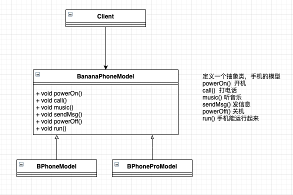
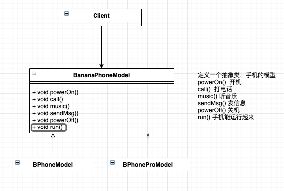
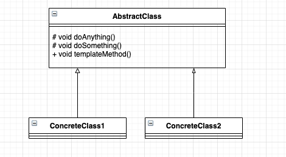
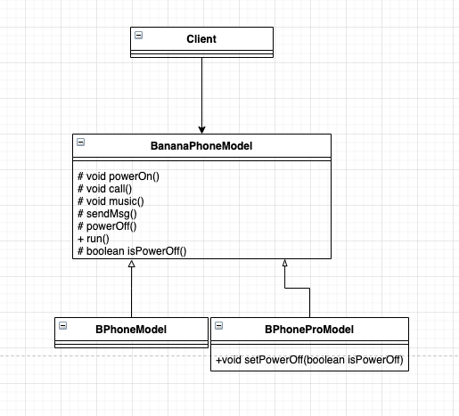

# 模板方法模式


## 一起做个手机

apple 公司 9月7号开发布会了，当然是发布他们的新手机——iphone14，当然，这个发布会跟我没什么关系，因为王守义都说： ‘13香’。

但是，在9月7号当天，我也想造一部手机，给自己提一波需求，蹭一蹭热度，至于手机的功能，那就先抄 iphone14 吧，我给它命名为 “BananaPhone”(简称 “BPhone”)。既然 iphone14 有多款机型（14,14Pro，14 Plus，14 Pro Max），那我也多做几款机型，争取能多卖出去。

开始准备动手做，由于这是第一次开始做手机，那就不考虑扩展性了，先来一波类图：



非常简单的实现，BPhone 有两个型号，BPhone 和 BPhone Pro。按照需求，先来一个 BananaPhone 的模型，先写一个抽象类，然后两个不同型号的模型实现类，通过简单的继承就可以实现业务需求。我们先从抽象类开始编写：

```typescript
abstract class BananaPhoneModel {
    // 能开机
    abstract powerOn(): void;
    // 能打电话
    abstract call(): void;
    // 能听音乐
    abstract music(): void;
    // 能发信息
    abstract sendMsg(): void;
    // 能关机
    abstract powerOff(): void;
    // 运行起来
    abstract run(): void;
}
```


在抽象类中，我们定义了 BananaPhone 模型都必须具有的特质：能开机、打电话、听音乐、发信息、关机。但每个型号的 BPhone 实现是不同的，普通的 BPhone 代码如下：

```typescript
class BPhoneModel extends BananaPhoneModel {
    call(): void {
        console.log(`能打电话，支持4G`)
    }
    music(): void {
        console.log(`能听音乐，但是需要开会员`)
    }
    powerOff(): void {
        console.log(`关机动画...一个香蕉`)
    }
    powerOn(): void {
        console.log(`开机动画...一个香蕉`)
    }
    sendMsg(): void {
        console.log(`只能给联系人发短信，一条2毛`)
    }
    run(): void {
        // 先开机
        this.powerOn();
        // 打个电话试试
        this.call();
        // 听个音乐试试
        this.music();
        // 发条信息试试
        this.sendMsg();
        // 试完了 关机
        this.powerOff();
    }
}
```

大家注意看 `run()` 方法，这是一个汇总方法，一个模型生产成功了，总要拿给用户检测吧，所以这就是一种检验方法，让它运行起来！ 通过 `run()` 这样的方法，把模型的所有功能都测试到了。

BPhone Pro 代码如下：

```typescript
class BPhoneProModel extends BananaPhoneModel{
    call(): void {
        console.log(`能打电话，支持5G`)
    }
    music(): void {
        console.log(`能听音乐，自带网抑云会员`)
    }
    powerOff(): void {
        console.log(`关机动画...两个香蕉`)
    }
    powerOn(): void {
        console.log(`开机动画...两个香蕉`)
    }
    sendMsg(): void {
        console.log(`给所有人发短信，一条1毛`)
    }
    run(): void {
        // 先开机
        this.powerOn();
        // 打个电话试试
        this.call();
        // 听个音乐试试
        this.music();
        // 发条信息试试
        this.sendMsg();
        // 试完了 关机
        this.powerOff();
    }

}
```

好了，程序编写到这里，已经发现问题了，两个实现类的 `run()` 方法都是完全相同的，那这个 `run()` 方法的实现应该出现在抽象类，不应该在实现类上，抽象是所有子类的共性封装.

> 注意: 在软件开发过程中，如果相同的一段代码复制过两次，就需要对设计产生怀疑，并要明确说明为什么相同的逻辑要出现两次或更多次

好，问题发现了，我们就需要马上更改，然后修改后的类图：



注意，抽象类 **BananaPhoneModel** 中的 `run()` 方法，由抽象方法变更为实现方法：

```typescript
abstract class BananaPhoneModel {
    // 能开机
    abstract powerOn(): void;
    // 能打电话
    abstract call(): void;
    // 能听音乐
    abstract music(): void;
    // 能发信息
    abstract sendMsg(): void;
    // 能关机
    abstract powerOff(): void;
    // 运行起来
    run(): void {
        // 先开机
        this.powerOn();
        // 打个电话试试
        this.call();
        // 听个音乐试试
        this.music();
        // 发条信息试试
        this.sendMsg();
        // 试完了 关机
        this.powerOff();
    }
}

class BPhoneModel extends BananaPhoneModel {
    call(): void {
        console.log(`能打电话，支持4G`)
    }
    music(): void {
        console.log(`能听音乐，但是需要开会员`)
    }
    powerOff(): void {
        console.log(`关机动画...一个香蕉`)
    }
    powerOn(): void {
        console.log(`开机动画...一个香蕉`)
    }
    sendMsg(): void {
        console.log(`只能给联系人发短信，一条2毛`)
    }

}

class BPhoneProModel extends BananaPhoneModel{
    call(): void {
        console.log(`能打电话，支持5G`)
    }
    music(): void {
        console.log(`能听音乐，自带网抑云会员`)
    }
    powerOff(): void {
        console.log(`关机动画...两个香蕉`)
    }
    powerOn(): void {
        console.log(`开机动画...两个香蕉`)
    }
    sendMsg(): void {
        console.log(`给所有人发短信，一条1毛`)
    }
}
```

在抽象的 BananaPhone 模型上已经定义了 `run()` 方法的执行规则，先开机，然后打电话、听音乐、发信息，最后用完手机为了省电...直接关机 ！

场景类实现的任务就是把我们做出来的手机展示给用户看：

```typescript
class Clinet {
    // 我们把两部手机都展示出来，方便用户对比
    static main(): void {
        // 先用一般机型做个抛砖引玉
        const bp1 = new BPhoneModel();
        // 功能演示
        bp1.run();
        console.log(`-----分割线-----`)
        // 然后把我们的高端机 Pro 拿出来
        const bp2 = new BPhoneProModel();
        // 功能演示
        bp2.run();
    }
}

Clinet.main();
```

运行结果如下：

```shell
开机动画...一个香蕉
能打电话，支持4G
能听音乐，但是需要开会员   
只能给联系人发短信，一条2毛
关机动画...一个香蕉        
-----分割线-----
开机动画...两个香蕉        
能打电话，支持5G
能听音乐，自带网抑云会员   
给所有人发短信，一条1毛    
关机动画...两个香蕉        
```

如果我告诉你这就是模板方法模式你会不会很不屑...就这模式，太简单了，我一直在使用呀！是的，你经常在使用，但你可能不知道这是模板方法模式...


## 模板方法模式的定义

模板方法模式（Template Method Pattern）是如此简单，一直让你感觉已经能够掌握其精髓了。其定义如下：

**Define the skeleton of an algorithm in an operation， deferring some steps to subclasses. Template Method lets subclasses redefine certain steps of an algorithm without changing the algorithm's structure. （定义一个操作中的算法的结构，而将一些步骤延迟到子类中。使得子类可以不改变一个算法的结构即可重定义该算法的某些特定步骤。）**

模板方法模式的通用类图如图：



模板方法模式确实非常简单，仅仅用了继承机制，单它是一个应用非常广泛的模式。其中，`AbstractClass` 叫做抽象模板，它的方法分为两类：

- 基本方法

基本方法也叫作基本操作，是由子类实现的方法，并且在模板方法中被调用。

- 模板方法

可以有一个或几个，一般是一个具体方法，也就是一个框架，实现对基本方法的调度，完成固定的逻辑。

> 在 java 中，为了防止恶意的操作，一般模板方法都加上 final 关键字，不允许被覆写。TS 中需要额外注意

在类图中还有一个角色： 具体模板。`ConcreteClass1` 和 `ConcreteClass1` 属于具体模板，实现父类所定义的一个或多个抽象方法，也就是父类定义的基本方法在子类中得以实现。

我们来看一下通用模板

- 抽象模板类

```typescript
abstract class AbstractClass {
    // 基本方法
    protected abstract doSomething(): void;
    // 基本方法
    protected abstract doAnything(): void;
    // 模板方法
    templateMethod(): void {
        /**
             * 调用基本方法，完成相关的逻辑
             */
        this.doSomething();
        this.doAnything();
    }
}
```

- 具体模板类

```typescript
class ConcreteClass1 extends AbstractClass {
    protected doAnything(): void {
        // 业务处理逻辑
        console.log(`ConcreteClass1 doAnything`)
    }

    protected doSomething(): void {
        // 业务处理逻辑
        console.log(`ConcreteClass1 doSomething`)
    }

}

class ConcreteClass2 extends AbstractClass {
    protected doAnything(): void {
        // 业务逻辑
        console.log(`ConcreteClass2 doAnything`)
    }

    protected doSomething(): void {
        // 业务逻辑
        console.log(`ConcreteClass2 doSomething`)
    }
}
```

- 场景类

```typescript
class Client {
    static main(): void {
        const class1 = new ConcreteClass1();
        const class2 = new ConcreteClass2();
        class1.templateMethod();
        class2.templateMethod();
    }
}

Client.main();
```

- 输出结果

```shell
ConcreteClass1 doSomething
ConcreteClass1 doAnything 
ConcreteClass2 doSomething
ConcreteClass2 doAnything 
```


> 注意：抽象模板中的基本方法尽量设计为 `protected` 类型，符合迪米特法则，不需要暴露的属性或方法尽量不要设置为 `protected` 类型。实现类若非必要，尽量不要扩大父类中的访问权限。


## 模板方法模式的应用

### 模板方法模式的优点

- 封装不变部分，扩展可变部分

把认为是不变部分的算法封装到父类实现，而可变部分的则可以通过继承来继续扩展。在 BPhone 的例子中，是不是就非常容易扩展。例如增加一个 BPhone Pro Max 模型，很容易呀，增加一个子类，实现父类的基本方法就可以了。

- 提取公共部分代码，便于维护

我们例子刚刚走过的弯路就是最好的证明，如果我们不抽取到父类中，任由这种散乱的代码发生，想想后果是什么样子？维护人员为了修正一个缺陷，需要导出查找类似的代码！

- 行为由父类控制，子类实现

基本方法是由子类实现的，因此子类可以通过扩展的方式增加相应的功能，符合开闭原则。


### 模板方法模式的缺点

按我们的设计习惯，抽象类负责声明最抽象、最一般的事物属性和方法，实现类完成具体的事物属性和方法。但是模板方法模式却颠倒了，抽象类定义了部分抽象方法，由子类实现，自雷执行的结果影响了父类的结果，也就是子类对父类产生了影响，这在复杂项目中，会带来代码阅读的难度。


### 模板方法模式的使用场景

- 多个子类有公有的方法，并且逻辑基本相同时。
- 重要、复杂的算法，可以把核心算法设计为模板方法，周边的相关细节功能由各个子类实现
- 重构时，模板方法模式是一个经常使用的模式，把相同的代码抽取到父类中，然后通过钩子函数（见 “模板方法模式的扩展” ）约束其行为。


### 模板方法模式的扩展

到目前为止，这两个模型都稳定地运行，突然有一天，用户突然要退货：

"看你怎么做的手机，电话一开机，我打完电话，听完音乐，发完信息，就自动关机了！但是我不想让我的手机直接关机。"

唉，又不是不能用，但是既然是用户提出的，还是尽量满足的好，稍微思考一下，先来个类图解解压。




类图改动似乎很小，在抽象类 `BananaPhoneModel` 中增加了一个实现方法 `isPowerOff` ，确定各个型号的手机是否需要关机，由各个实现类覆写该方法，同事其他的基本方法由不需要对外提供访问，因此也设计为 **protected** 类型。

- 抽象后的抽象模板类

```typescript
abstract class BananaPhoneModel {
    // 能开机
    protected abstract powerOn(): void;
    // 能打电话
    protected abstract call(): void;
    // 能听音乐
    protected abstract music(): void;
    // 能发信息
    protected abstract sendMsg(): void;
    // 能关机
    protected abstract powerOff(): void;
    // 运行起来
    run(): void {
        // 先开机
        this.powerOn();
        // 打个电话试试
        this.call();
        // 听个音乐试试
        this.music();
        // 发条信息试试
        this.sendMsg();
        // 试完了 关机
        if (this.isPowerOff()) {
            this.powerOff();
        } else {
            console.log(`不关机 继续运行`);
        }
    }
    // 狗子方法
    protected isPowerOff(): boolean {
        return true
    }
}
```

在抽象类中，`isPowerOff` 是一个实现方法。起作用是模板方法根据其返回的值决定是否需要关机，子类可以覆写该返回值，用户想自己控制他开关机，进行人为控制。

- 扩展后的 BPhone

```typescript
class BPhoneModel extends BananaPhoneModel {
    // 默认关机
    private powerOffFlag = true;

    protected call(): void {
        console.log(`能打电话，支持4G`)
    }
    protected music(): void {
        console.log(`能听音乐，但是需要开会员`)
    }
    protected powerOff(): void {
        console.log(`关机动画...一个香蕉`)
    }
    protected powerOn(): void {
        console.log(`开机动画...一个香蕉`)
    }
    protected sendMsg(): void {
        console.log(`只能给联系人发短信，一条2毛`)
    }
    protected isPowerOff(): boolean {
        return this.powerOffFlag;
    }
    // 要不要关机用户决定
    setPowerOff(isPowerOff: boolean) {
        this.powerOffFlag = isPowerOff;
    }
}
```

只要调用 `BPhone` 型号的手机，默认是关机的，当然可以可以不关机，通过 `isPowerOff(false)` 就可以实现。Pro 是默认不关机的，代码如下：

- 扩展后的 Pro

```typescript
    class BPhoneProModel extends BananaPhoneModel{
        protected call(): void {
            console.log(`能打电话，支持5G`)
        }
        protected music(): void {
            console.log(`能听音乐，自带网抑云会员`)
        }
        protected powerOff(): void {
            console.log(`关机动画...两个香蕉`)
        }
        protected powerOn(): void {
            console.log(`开机动画...两个香蕉`)
        }
        protected sendMsg(): void {
            console.log(`给所有人发短信，一条1毛`)
        }
        // 默认不关机
        protected isPowerOff(): boolean {
            return false;
        }
    }
```

Pro 信号的手机设置了 `isPowerOff` 的返回值为 false，也就是关闭了关机功能。场景类代码如下：

```typescript
    class Client {
        static main(): void {
            // 用户订购了一台普通型号的 BPhone
            const bp1 = new BPhoneModel();
            // 用户想让他自动关机
            bp1.setPowerOff(true);
            // 用户又订购了一台普通型号的 BPhone
            const bp2 = new BPhoneModel();
            // 用户想让他不关机
            bp2.setPowerOff(false);
            // 最后用户订购了一台 pro
            const bPro = new BPhoneProModel();
            // 最后开始演示功能
            console.log(`-----分割线---bp1 想让它自动关机--`)
            bp1.run();
            console.log(`-----分割线---bp2 不想让它自动关机--`)
            bp2.run();
            console.log(`-----分割线---bPro 不能关机--`)
            bPro.run();
            
        }
    }

    Client.main();
```

- 结果如下：

```shell
-----分割线---bp1 想让它自动关机--
开机动画...一个香蕉
能打电话，支持4G
能听音乐，但是需要开会员
只能给联系人发短信，一条2毛
关机动画...一个香蕉
-----分割线---bp2 不想让它自动关机--
开机动画...一个香蕉
能打电话，支持4G
能听音乐，但是需要开会员
只能给联系人发短信，一条2毛
不关机 继续运行
-----分割线---bPro 不能关机--       
开机动画...两个香蕉
能打电话，支持5G
能听音乐，自带网抑云会员
给所有人发短信，一条1毛
不关机 继续运行
```

最后普通型号的都是由自己控制是否要关机，也就是说外界条件改变，影响到模板方法的执行。在我们抽象类中 `isPowerOff` 的返回值就是影响了模板方法的执行结果，该方法就叫做 **钩子方法（Hook Method）** 。有了钩子方法模板方法才算完美，大家可以想想，由子类的一个方法返回值决定公共部分的执行结果，是不是很有吸引力！

模板方法模式就是在模板方法中按照一定的规则和顺序调用基本方法，具体到前面那个例子，就是 `run()` 方法按照规定的顺序（先调用 `powerOn()`， 再调用 `call()`... 最后调用 `powerOff()`）调用本类的其他方法，并且由 `isPowerOff()` 方法的返回值确定 `run()` 中的执行变更。


## 小结

有时候在编程的时候，有可能会碰到一个场景“父类怎么调用子类的方法”。这个问题很有普遍性，那么父类是否可以调用子类的方法？我的回答是能，但强烈地不建议这么做：

- 把子类传递到父类的有参构造函数中，然后调用。
- 使用反射的方式调用
- 父类调用子类的静态方法。

这三种方法都是父类直接调用子类的方法，好用不？好用！问题解决了吗？解决了！但是项目中允许使用不？不允许...

父类建立框架，子类重写了父类部分方法后，再调用从父类继承的方法，产生不同的结果（而这正是模板方法模式）。这是不是也可以理解为父类调用了子类的方法呢？你修改了子类，影响了父类的行为的结果，曲线救国的方式实现了父类依赖子类的场景，模板方法模式就是这种场景。
