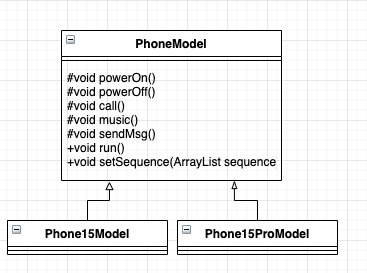
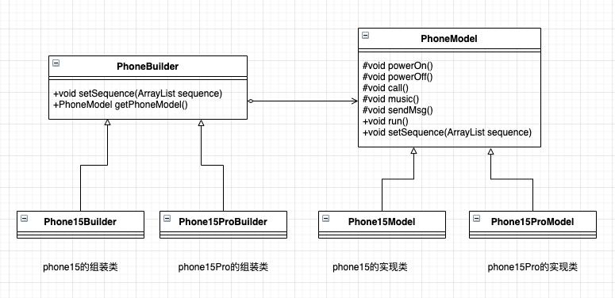
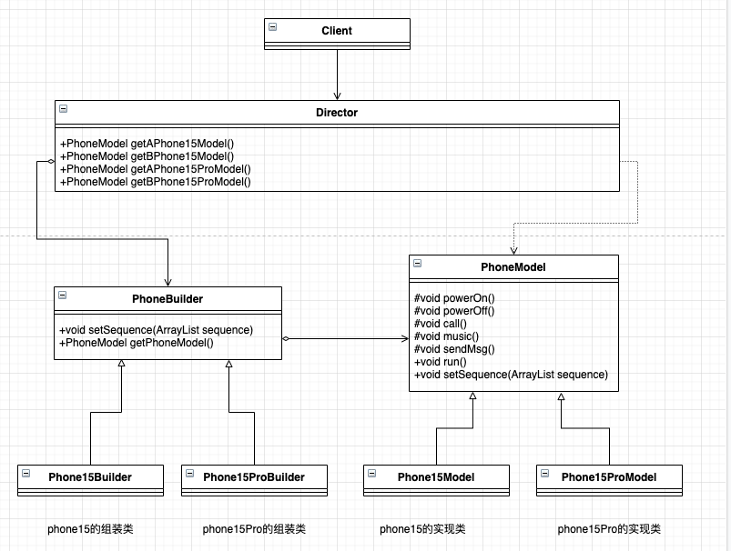
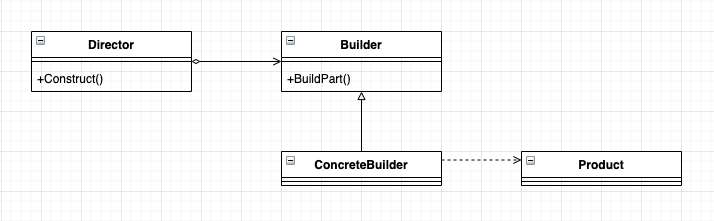

# 建造者模式（Builder Pattern）


## 变化是永恒的

新研制的手机走向市场了，用户很满意我们之前做的 BPhone，但是手机研制不是一成不变的，用户是永远得不到满足的，于是用户提了一些新需求：希望下一代手机，开机、关机、打电话、听音乐和发信息都是由用户自己来控制，他想要什么顺序就什么顺序，而且希望尽快研制出来。

那这次的迭代又是一个时间紧，任务重，工程量大的项目。

首先，还是分析一下需求，我们要更新换代，从根源上来讲都还是手机的范畴，那不管是什么机型，那就都是一个产品，它们有共有的属性，用户A关心的是手机的使用：先发信息，再听音乐，最后打电话...到我们这里，就是满足用户的要求，要什么顺序，就能根据用户所要求的顺序而产生什么顺序的模型，最后我们就只需要把这个要求实现出来，而且还要批量的。由我生产出来N多个手机模型，这些手机模型都有 `run()` 方法，但是具体到每个模型的 `run()` 方法中间的执行任务的顺序是不同的，用户要什么顺序，我就给什么顺序。还是先来一个类图，直观体现一下：



类图比较简单，在 **PhoneModel** 中我们定义了一个 `setSequence` 方法，手机模型的这几个动作要如何排队，是在这个 `ArrayList` 中定义的，其实可以理解为一个 `string[]` 。然后 `run()` 方法根据 *sequence* 定义的顺序完成指定的顺序动作，与之前的模板方法模式是不是非常类似。

```typescript
abstract class PhoneModel {
    private sequence: string[] = [];
    // 能开机
    protected abstract powerOn(): void;
    // 能打电话
    protected abstract call(): void;
    // 能听音乐
    protected abstract music(): void;
    // 能发信息
    protected abstract sendMsg(): void;
    // 能关机
    protected abstract powerOff(): void;
    // 运行起来
    run(): void {
        // 循环一遍，谁在前，先执行谁
        for (const actionName of this.sequence) {
            if (actionName === 'power on') {
                this.powerOn();
            } else if (actionName === 'power off') {
                this.powerOff();
            } else if (actionName === 'call') {
                this.call();
            } else if (actionName === 'music') {
                this.music();
            } else if (actionName === 'send msg') {
                this.sendMsg();
            }
        }
    }
    // 把传递过来的值传到类内
    setSequence(sequence: string[]): void {
        this.sequence = sequence;
    }
}
```

**PhoneModel** 的设计原理是这样的， `setSequence` 方法允许客户自己设置一个顺序，是要先打电话再发信息，还是要先发信息再听音乐。对于一个具体的模型永远都是固定的，但是对 N 多个模型就是动态了。在子类中实现父类的基本方法，`run()` 方法就是读取 *sequence* ，然后遍历 *sequence* 中的字符串，哪个字符串在先，就先执行哪个方法。

- Phone15Model

```typescript
class Phone15Model extends PhoneModel {
    protected call(): void {
        console.log(`phone15 能打电话，支持4G`)
    }
    protected music(): void {
        console.log(`phone15 能听音乐，但是需要开会员`)
    }
    protected powerOff(): void {
        console.log(`phone15 关机动画...一个香蕉`)
    }
    protected powerOn(): void {
        console.log(`phone15 开机动画...一个香蕉`)
    }
    protected sendMsg(): void {
        console.log(`phone15 只能给联系人发短信，一条2毛`)
    }

}
```

- Phone15ProModel

```typescript
class Phone15ProModel extends PhoneModel {
    protected call(): void {
        console.log(`phone15Pro 能打电话，支持5G`)
    }
    protected music(): void {
        console.log(`phone15Pro 能听音乐，自带网抑云会员`)
    }
    protected powerOff(): void {
        console.log(`phone15Pro 关机动画...两个香蕉`)
    }
    protected powerOn(): void {
        console.log(`phone15Pro 开机动画...两个香蕉`)
    }
    protected sendMsg(): void {
        console.log(`phone15Pro 给所有人发短信，一条1毛`)
    }
}
```

两个产品的实现类都完成了，我们来模拟一下用户的要求：生产一个 *Phone15* 模型，要求用的时候，先开机、然后听音乐、然后打电话、最后发信息，不需要关机。这个需求很容易满足，我们增加一个场景类实现该需求：

```typescript
class Client {
    static main(): void {
        const p15 = new Phone15Model();
        // 存放 run的顺序
        const sequence: string[] = [];
        // 先开机、然后听音乐、然后打电话、最后发信息，不需要关机
        sequence.push('power on');
        sequence.push('music');
        sequence.push('call');
        sequence.push('send msg');
        // 我们把这个顺序赋予 phone15
        p15.setSequence(sequence);
        p15.run();
    }
}

Client.main();
```

运行结果：

```shell
phone15 开机动画...一个香蕉
phone15 能听音乐，但是需要开会员   
phone15 能打电话，支持4G
phone15 只能给联系人发短信，一条2毛
```

到此为止，我们组装了一部手机，满足了用户的需求。但是想想我们的需求，手机的动作执行顺序是要能够随意调整的。我们只满足了一个需求，还有下一个需求，然后第二个 *Phone* 模型只要开机、关机，其他的什么都不需要；第三个模型，先开机，再听音乐，最后关机；第四个...直到把你逼疯为止，那怎么办？我们就一个一个地来写场景类满足吗？不可能了，那我们要想办法来解决这个问题，有了！我们为每种模型产品模型定义一个建造者，你要啥顺序直接告诉建造者，由建造者来建造，于是我们就有了：



增加了一个 **PhoneBuilder** 抽象类，由它来组装各个手机模型，要什么类型什么顺序的手机模型，都由相关的子类完成。首先编写 **PhoneBuilder** 代码

- PhoneBuilder

```typescript
abstract class PhoneBuilder {
    // 建造一个模型，你要给我一个顺序要求，就是组装顺序
    abstract setSequence(sequence: string[]): void;
    // 设置完毕顺序后就可以直接拿到这个手机模型
    abstract getPhoneModel(): PhoneModel;
}
```

很简单，每个手机模型都要有确定的运行顺序，然后才能返回一个手机模型。

- Phone15 的组装者如下

```typescript
class Phone15Builder extends PhoneBuilder {
    private p15 = new Phone15Model();
    getPhoneModel(): PhoneModel {
        return this.p15;
    }

    setSequence(sequence: string[]): void {
        this.p15.setSequence(sequence);
    }

}
```

- Phone15Pro 的组装者

```typescript
class Phone15ProBuilder extends PhoneBuilder {
    private p15Pro = new Phone15ProModel();
    getPhoneModel(): PhoneModel {
        return this.p15Pro;
    }

    setSequence(sequence: string[]): void {
        this.p15Pro.setSequence(sequence);
    }
}
```

两个都组装完成了，我们再修改一下场景类，来满足用户的需求

```typescript
class Client {
    static main(): void {
        // 存放 run的顺序
        const sequence: string[] = [];
        // 先开机、然后听音乐、然后打电话、关机, 不需要发信息
        sequence.push('power on');
        sequence.push('music');
        sequence.push('call');
        sequence.push('power off');
        // 要一个 phone15Pro
        const p15ProBuilder = new Phone15ProBuilder();
        // 把顺序给这个 builder 类，制造出一个这样的手机来
        p15ProBuilder.setSequence(sequence);
        // 制造一个 phone15pro
        const p15Pro = p15ProBuilder.getPhoneModel()
        p15Pro.run();
        console.log(`--------------分割线--------------`)
        // 相同顺序再来造一个 phone15
        const p15Builder = new Phone15Builder();
        p15Builder.setSequence(sequence);
        // 生产 phone15
        const p15 = p15Builder.getPhoneModel();
        p15.run();
    }
}

Client.main();
```

运行结果：

```shell
phone15Pro 开机动画...两个香蕉
phone15Pro 能听音乐，自带网抑云会员
phone15Pro 能打电话，支持5G        
phone15Pro 关机动画...两个香蕉     
--------------分割线-------------- 
phone15 开机动画...一个香蕉        
phone15 能听音乐，但是需要开会员   
phone15 能打电话，支持4G
phone15 关机动画...一个香蕉   
```

看，相同运行顺序的两个手机都生产出来了，而且代码是不是比刚开始直接访问产品类简单了很多。我们在做项目时，经常会有一个共识：需求是无底洞，是无理性的，不可能你告诉他不增加需求就不增加，这几个过程（powerOn, powerOff, call, music, sendMsg）按照排列组合有很多种，用户可以随意组合，用户要什么顺序的手机就生成什么顺序的模型，客户是上帝！那我们不可能预知他们要什么顺序的模型呀，怎么办？封装一下，找一个导演，指挥各个事件的先后顺序，然后为每种顺序指定一个代码，你说一种我们立刻就给你生产处理，好方法，厉害！我们先修改一下类图：




类图看着复杂了，但还是比较简单，我们增加了一个 **Director** 类，负责按照指定的顺序生产模型，其中方法说明如下：

- getAPhone15Model 方法

组建出A型号 Phone15 手机模型，其过程为只有开机（powerOn）、打电话（call）方法，其他的听音乐，发信息和关机都没有

- getBPhone15Model 方法

组建出B型号 Phone15 手机模型，其过程为只有开机（powerOn）、发信息（sendMsg）方法，其他的听音乐，打电话和关机都没有

- getAPhone15ProModel 方法

组建出A型号 Phone15Pro 手机模型，其过程为只有开机（powerOn）、打电话（call）、听音乐（music）方法，其他的发信息，关机都没有

- getBPHone15ProModel 方法

组建出B型号 Phone15Pro 手机模型，其过程有开机（powerOn）、打电话（call）、听音乐（music）、发信息（sendMsg）、关机（powerOff）

其他的 E 型号、F 型号... 可以有很多，听音乐，发信息，打电话这几个方法在这个类中随意地自由组合：

```typescript
class Director {
    private sequence: string[] = [];
    private phone15Builder = new Phone15Builder();
    private phone15ProBuilder = new Phone15ProBuilder();

    /**
      * A型号 Phone15 手机模型，其过程为只有开机（powerOn）、打电话（call）方法，其他的听音乐，发信息和关机都没有
      */
    getAPhone15Model(): PhoneModel {
        // 清理执行场景
        this.sequence = [];
        this.sequence.push('power on');
        this.sequence.push('call');
        this.phone15Builder.setSequence(this.sequence);
        return this.phone15Builder.getPhoneModel();
    }

    /**
      * B型号 Phone15 手机模型，其过程为只有开机（powerOn）、发信息（sendMsg）方法，其他的听音乐，打电话和关机都没有
      */
    getBPhone15Model(): PhoneModel {
        // 清理执行场景
        this.sequence = [];
        this.sequence.push('power on');
        this.sequence.push('send msg');
        this.phone15Builder.setSequence(this.sequence);
        return this.phone15Builder.getPhoneModel()
    }

    /**
      * A型号 Phone15Pro 手机模型，其过程为只有开机（powerOn）、打电话（call）、听音乐（music）方法，其他的发信息，关机都没有
      */
    getAPhone15ProModel(): PhoneModel {
        // 清理执行场景
        this.sequence = [];
        this.sequence.push('power on');
        this.sequence.push('call');
        this.sequence.push('music');
        this.phone15ProBuilder.setSequence(this.sequence);
        return this.phone15ProBuilder.getPhoneModel();
    }
    /**
      * B型号 Phone15Pro 手机模型，其过程有开机（powerOn）、打电话（call）、听音乐（music）、发信息（sendMsg）、关机（powerOff）
      */
    getBPhone15ProModel(): PhoneModel {
        // 清理执行场景
        this.sequence = [];
        this.sequence.push('power on');
        this.sequence.push('call');
        this.sequence.push('music');
        this.sequence.push('send msg');
        this.sequence.push('power off');
        this.phone15ProBuilder.setSequence(this.sequence);
        return this.phone15ProBuilder.getPhoneModel();
    }

    /**
      * 这里还可以有很多方法，很多方法，随意排列组合
      * 导演类嘛，按照什么顺序还是导演说了算
      */
}
```

有了这样一个导演雷后，我们的场景类就更容易处理了，PXX 平台直接订购了 A 类型的10000部，B类型的1000部，C类型500部，D类型的100部

```typescript
class Client {
    static main(): void {
        const director = new Director();
        //  A 类型的 10000 部
        for (let i = 0; i < 10000; i++) {
            director.getAPhone15Model().run();
        }
        // B类型的 1000 部
        for (let i = 0; i < 1000; i++) {
            director.getBPhone15Model().run();
        }
        // C类型500部
        for (let i = 0; i < 500; i++) {
            director.getAPhone15ProModel().run();
        }
        // D类型的100部
        for (let i = 0; i < 100; i++) {
            director.getBPhone15ProModel().run()
        }
    }
}

Client.main()
```

运行结果：

```shell
# 算了吧，挺多的，不展示了
```

清晰、简单吧，我们写程序重构的最终目的就是：简单、清晰。

## 建造者模式的定义

建造者模式（Builder Pattern）也叫作生成器模式，其定义如下：

**Separate the construction of a complex object from its representation so that the same construction process can create different representations.（将一个复杂对象的构建与它的表示分离，使得同样的构建过程可以创建不同的表示。）**

建造者模式的通用类图如下：



在建造者模式中，有如下4个角色：

- Product 产品类

通常是实现了模板方法模式，也就是有模板方法和基本方法，这个参考之前的 **模板方法模式** 中的例子。

- Builder 抽象建造者

规范产品的组件，一般由子类实现。例子中 *PhoneBuilder* 就属于抽象建造者。

- ConcreteBuilder 具体建造者

实现抽象类定义的所有方法，并且返回一个组建好的对象。例子中的 *Phone15Builder* 和 *Phone15ProBuilder* 就属于具体建造者。

- Director 导演类

负责安排已有模块的顺序，然后告诉 Builder 开始建造。就好比说：客户要这个或那个类型的手机模型，然后我就开始拼命地建造，于是一个项目建设完毕了。

建造者模式的通用源码也比较简单，先看 **Product类** ，通常它是一个组合或继承（如模板方法模式）产生的类。

- 产品类

```typescript
class Product {
    doSomething(): void {
        // 独立业务处理
    }
}
```

- 抽象建造者

```typescript
abstract class Builder {
    // 设置产品不同的部分，以获得不同的产品
    abstract setPart(): void;
    // 建造产品
    abstract buildProduct(): Product;
}
```

- 具体建造者

```typescript
class ConcreteBuilder extends Builder {
    private product = new Product();
    // 设置产品零件
    setPart(): void {
        /*
         * 产品类内的逻辑处理
         */
    }

    buildProduct(): Product {
        return this.product;
    }
}
```

需要注意的是，如果有多个产品类就有几个具体的建造者，而且这多个产品类具有相同的接口和抽象类。

- 导演类

```typescript
class Director {
    private builder = new ConcreteBuilder();
    // 构建不同的产品
    getAProduct() {
        this.builder.setPart();
        /*
         * 设置不同的零件，产生不同的产品
         */
        return this.builder.buildProduct();
    }
}
```

导演类起到封装的作用，避免高层模块深入到建造者内部的实现类。当然，在建造者模式比较庞大时，导演类可以有多个。

## 建造者模式的应用


### 建造者模式的优点

- 封装性

使用建造者模式可以使客户端不必知道产品内部组成的细节，如例子中我们不需要关心每一个具体的模型内部是如何实现的，产生的对象就是 *PhoneModel* 。

- 建造者独立，容易扩展

*Phone15Builder* 和 *Phone15ProBuilder* 是相互独立的，对系统的扩展非常有利

- 便于控制细节风险

由于具体的建造者是独立的，因此我们可以对建造过程逐步细化，而不对其他的模块产生任何影响。

### 建造者模式的使用场景

- 相同的方法，不同的执行顺序，产生不同的事件结果时，可以采用建造者模式
- 多个部件或零件，都可以装配到一个对象中，但是产生的运行结果又不同时，则可以使用该模式。
- 产品类非常复杂，或者产品类中的调用顺序不同产生了不同的效能，这个时候使用建造者模式非常合适。
- 在对象创建过程中会使用到系统中的一些其他对象，这些对象在产品对象的创建过程中不容易得到时，也可以采用建造者模式封装该对象的创建过程。该种场景只能是一个补偿方法，因为一个对象不容易获得，而在设计阶段竟然没有发觉，而要通过建造者模式柔化创建过程，本身已经违反设计的最初目标。

### 建造者模式的注意事项

建造者模式关注的是零件类型和装配工艺（顺序），这是它与工厂方法模式最大不同的地方，虽然同为创建类模式，但是注重点不同。


## 建造者模式的扩展

已经不用扩展了，因为我们在手机模型制造的例子中已经对建造者模式进行了扩展，引入了模板方法模式。

大家看到这里估计会开始犯嘀咕了，这个建造者模式和工厂模式非常相似呀，是的，非常相似，但是记住一点你就可以游刃有余地使用了：建造者模式最主要的功能是基本方法的调用顺序安排，也就是这些基本方法已经实现了，通俗地说就是零件的装配，顺序不同产生的对象也不同；而工厂方法则重点是创建，创建零件是它的主要职责，组装顺序则不是它关心的。

## 小结

再次说明，在使用建造者模式的时候考虑一下模板方法模式，别孤立地思考一个模式，僵化套用一个模式会让你受害无穷！
