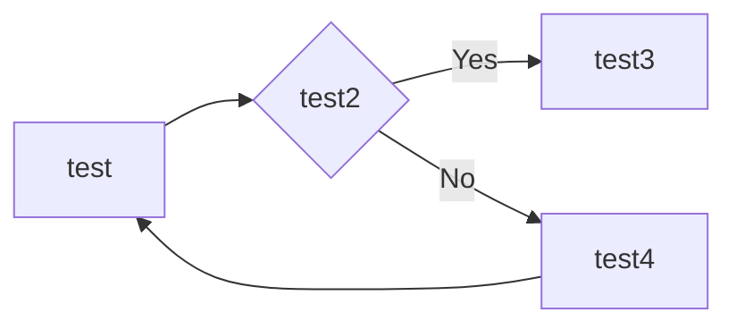

# 代理模式

## 我是游戏至尊

2018 年，感觉很无聊，于是就玩了一段时间的网络游戏，游戏名就不说了，反正就是打怪、升级、PK，然后继续打怪、升级、打怪、升级... 我花了一个月的时间升到 90 级，已经，已经很有成就感了，但是打副本的时候 dps 永远是最低的那个，组队打副本的时候对于咱这种非 RMB 玩家基本上都是懒得搭理，也就 PVP、PVE 的时候装备比较平衡，当时也不算是手残，也算是比较有名望。在这段时间我是体会到网络游戏的乐与苦，参与工会战，胜利后的那种成就感非常使人满足。那苦什么呢？就是装备，为了打更好的装备，就要去更厉害的副本，奈何本身装备就拉胯，人家一看你装备不行，也不会组你...后来也只能一个人过每日任务、周任务、搬砖，硬生生把一个网络游戏玩成了单机游戏，每天都有刷不完的副本，我曾经的记录是连续打了 3 天 3 夜的副本，后来睡觉做梦还在打 BOSS。那现在我们就把这段打游戏的过程系统化，非常简单的一个过程。

太简单了，定义一个接口 `IGamePlayer` ，是所有西海网络游戏的玩家，然后定义一个具体的实现类 `GamePlayer` ，实现每个游戏爱好者为了玩游戏要执行的功能。代码也非常简单，我们先来看 `IGamePlayer`。

```typescript
interface IGamePlayer {
  // 登录游戏
  login(user: string, password: string): void

  // 杀怪，网络游戏的主要特色
  killBoss(): void

  // 升级
  upgrade(): void
}
```

非常简单，定义了三个方法，分别是我们在网络游戏中最常用的功能：登录游戏、杀怪和升级，其实现类如下：

