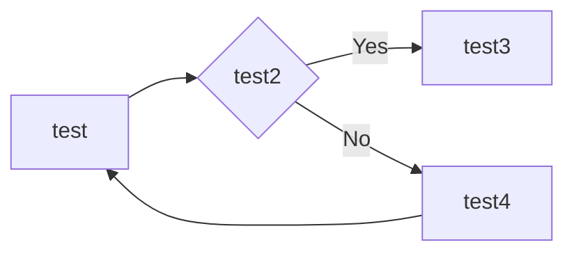

# 代理模式

## 我是游戏至尊

2018 年，感觉很无聊，于是就玩了一段时间的网络游戏，游戏名就不说了，反正就是打怪、升级、PK，然后继续打怪、升级、打怪、升级... 我花了一个月的时间升到 90 级，已经，已经很有成就感了，但是打副本的时候 dps 永远是最低的那个，组队打副本的时候对于咱这种非 RMB 玩家基本上都是懒得搭理，也就 PVP、PVE 的时候装备比较平衡，当时也不算是手残，也算是比较有名望。在这段时间我是体会到网络游戏的乐与苦，参与工会战，胜利后的那种成就感非常使人满足。那苦什么呢？就是装备，为了打更好的装备，就要去更厉害的副本，奈何本身装备就拉胯，人家一看你装备不行，也不会组你...后来也只能一个人过每日任务、周任务、搬砖，硬生生把一个网络游戏玩成了单机游戏，每天都有刷不完的副本，我曾经的记录是连续打了 3 天 3 夜的副本，后来睡觉做梦还在打 BOSS。那现在我们就把这段打游戏的过程系统化，非常简单的一个过程。


太简单了，定义一个接口 `IGamePlayer` ，是所有西海网络游戏的玩家，然后定义一个具体的实现类 `GamePlayer` ，实现每个游戏爱好者为了玩游戏要执行的功能。代码也非常简单，我们先来看 `IGamePlayer`。

- 游戏者接口

```typescript
interface IGamePlayer {
  // 登录游戏
  login(user: string, password: string): void

  // 杀怪，网络游戏的主要特色
  killBoss(): void

  // 升级
  upgrade(): void
}
```

非常简单，定义了三个方法，分别是我们在网络游戏中最常用的功能：登录游戏、杀怪和升级，其实现类如下：

- 游戏者

```typescript
class GamePlayer implements IGamePlayer {
  private readonly name: string = ''
  // 通过构造函数传递名称
  constructor(_name: string) {
    this.name = _name
  }

  // 打怪, 最期望的就是打怪
  killBoss(): void {
    console.log(this.name + '在打怪')
  }
  // 进游戏之前你肯定要登录吧,这是一个必要条件
  login(user: string, password: string): void {
    console.log('登录名为' + user + '的用户' + this.name + '登录成功')
  }
  // 升级,升级有很多方法,花钱买是一种,做任务也是一种
  upgrade(): void {
    console.log(this.name + '又升了一级!')
  }
}
```

在实现类中通过构造函数传递进来玩家姓名，方便进行后期的调试工作。我们通过一个场景类来模拟这样的游戏过程：

- 场景类

```typescript
class Client {
  static main(): void {
    // 定义一个痴迷的玩家
    const player: IGamePlayer = new GamePlayer('张三');
    // 开始打游戏,记下时间戳
    console.log('开始时间是: 2022年10月02日22:55:51');
    player.login('zhangSan', '123456');
    // 开始杀怪
    player.killBoss();
    // 升级
    player.upgrade();
    // 记录结束游戏时间
    console.log('结束时间是: 2022年10月02日22:57:07');
  }
}

Client.main();
```

程序记录了游戏的开始时间和结束时间，同时也记录了在游戏过程中都需要做什么事情，运行结果如下：

```shell
开始时间是: 2022年10月02日22:55:51
登录名为zhangSan的用户张三登录成功
张三在打怪
张三又升了一级!
结束时间是: 2022年10月02日22:57:07
```

运行结果也是我们想要的，记录我这段时间的网游生涯。心理学家告诉我们，人类对于苦难的记忆比对喜悦的记忆要深刻，但是人类对于喜悦是“趋利”性的，每个人都想 Happy ，都不想让苦难靠近，想要获得幸福，苦难也是在所难免的，我们的网游生涯也是如此。游戏打时间长了，腰酸背痛、眼睛干涩、手臂酸麻，等等，也就是网络成瘾综合征都出来了。其结果就类似吃了那个 “含笑半步癫”。那怎么办呢？我们想玩游戏，但又不想触碰到游戏中的烦恼，如何解决呢？有办法，现在游戏代练的公司非常多，我把自己的账号交给代练人员，由他们去帮我升级，去打怪，非常好的想法，我们来修改一下类图：

