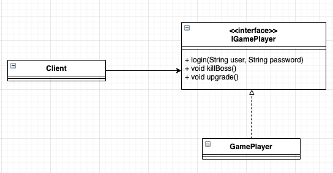
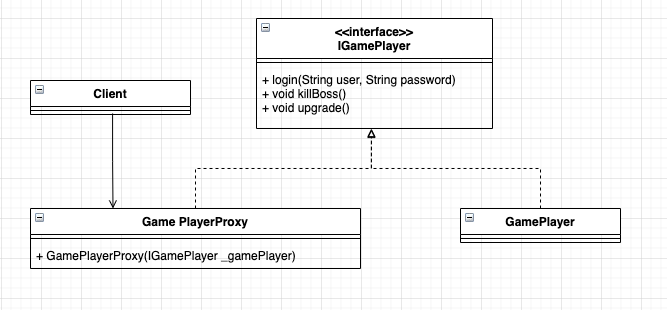
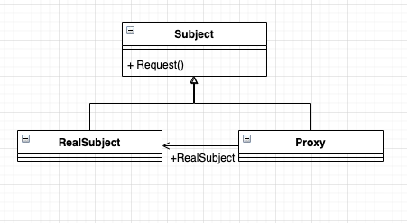
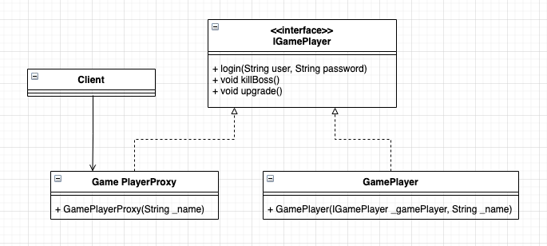
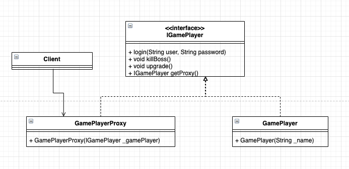
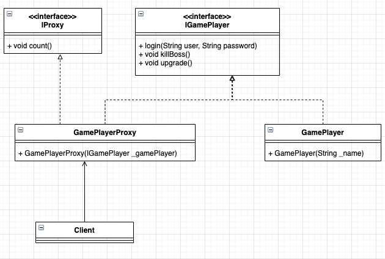

# 代理模式

## 我是游戏至尊

2018 年，感觉很无聊，于是就玩了一段时间的网络游戏，游戏名就不说了，反正就是打怪、升级、PK，然后继续打怪、升级、打怪、升级... 我花了一个月的时间升到 90 级，已经，已经很有成就感了，但是打副本的时候 dps 永远是最低的那个，组队打副本的时候对于咱这种非 RMB 玩家基本上都是懒得搭理，也就 PVP、PVE 的时候装备比较平衡，当时也不算是手残，也算是比较有名望。在这段时间我是体会到网络游戏的乐与苦，参与工会战，胜利后的那种成就感非常使人满足。那苦什么呢？就是装备，为了打更好的装备，就要去更厉害的副本，奈何本身装备就拉胯，人家一看你装备不行，也不会组你...后来也只能一个人过每日任务、周任务、搬砖，硬生生把一个网络游戏玩成了单机游戏，每天都有刷不完的副本，我曾经的记录是连续打了 3 天 3 夜的副本，后来睡觉做梦还在打 BOSS。那现在我们就把这段打游戏的过程系统化，非常简单的一个过程。



太简单了，定义一个接口 `IGamePlayer` ，是所有西海网络游戏的玩家，然后定义一个具体的实现类 `GamePlayer` ，实现每个游戏爱好者为了玩游戏要执行的功能。代码也非常简单，我们先来看 `IGamePlayer`。

- 游戏者接口

```typescript
interface IGamePlayer {
  // 登录游戏
  login(user: string, password: string): void

  // 杀怪，网络游戏的主要特色
  killBoss(): void

  // 升级
  upgrade(): void
}
```

非常简单，定义了三个方法，分别是我们在网络游戏中最常用的功能：登录游戏、杀怪和升级，其实现类如下：

- 游戏者

```typescript
class GamePlayer implements IGamePlayer {
  private readonly name: string = ''
  // 通过构造函数传递名称
  constructor(_name: string) {
    this.name = _name
  }

  // 打怪, 最期望的就是打怪
  killBoss(): void {
    console.log(this.name + '在打怪')
  }
  // 进游戏之前你肯定要登录吧,这是一个必要条件
  login(user: string, password: string): void {
    console.log('登录名为' + user + '的用户' + this.name + '登录成功')
  }
  // 升级,升级有很多方法,花钱买是一种,做任务也是一种
  upgrade(): void {
    console.log(this.name + '又升了一级!')
  }
}
```

在实现类中通过构造函数传递进来玩家姓名，方便进行后期的调试工作。我们通过一个场景类来模拟这样的游戏过程：

- 场景类

```typescript
class Client {
  static main(): void {
    // 定义一个痴迷的玩家
    const player: IGamePlayer = new GamePlayer('张三');
    // 开始打游戏,记下时间戳
    console.log('开始时间是: 2022年10月02日22:55:51');
    player.login('zhangSan', '123456');
    // 开始杀怪
    player.killBoss();
    // 升级
    player.upgrade();
    // 记录结束游戏时间
    console.log('结束时间是: 2022年10月02日22:57:07');
  }
}

Client.main();
```

程序记录了游戏的开始时间和结束时间，同时也记录了在游戏过程中都需要做什么事情，运行结果如下：

```shell
开始时间是: 2022年10月02日22:55:51
登录名为zhangSan的用户张三登录成功
张三在打怪
张三又升了一级!
结束时间是: 2022年10月02日22:57:07
```

运行结果也是我们想要的，记录我这段时间的网游生涯。心理学家告诉我们，人类对于苦难的记忆比对喜悦的记忆要深刻，但是人类对于喜悦是“趋利”性的，每个人都想 Happy ，都不想让苦难靠近，想要获得幸福，苦难也是在所难免的，我们的网游生涯也是如此。游戏打时间长了，腰酸背痛、眼睛干涩、手臂酸麻，等等，也就是网络成瘾综合征都出来了。其结果就类似吃了那个 “含笑半步癫”。那怎么办呢？我们想玩游戏，但又不想触碰到游戏中的烦恼，如何解决呢？有办法，现在游戏代练的公司非常多，我把自己的账号交给代练人员，由他们去帮我升级，去打怪，非常好的想法，我们来修改一下类图：



在类图中增加了一个 **GamePlayerProxy** 类来代表游戏代练者，它也不能有作弊的方法，游戏代练者也是手动打怪，因此同样继承 `IGamePlayer` 接口，其代码如下：

- 代练者

```typescript
class GamePlayerProxy implements IGamePlayer {
  private gamePlayer: IGamePlayer = null;
  // 通过构造函数传递要对谁进行代练
  constructor(_gamePlayer: IGamePlayer) {
    this.gamePlayer = _gamePlayer;
  }
  // 代练杀怪
  killBoss(): void {
    this.gamePlayer.killBoss();
  }
  // 代练登录
  login(user: string, password: string): void {
    this.gamePlayer.login(user, password);
  }
  // 代练升级
  upgrade(): void {
    this.gamePlayer.upgrade();
  }
}
```

很简单，首先通过构造函数说明要代谁打怪升级，然后通过手动开始代用户打怪，升级。场景类 **Client** 代码也稍作改动

- 改进后的场景类

```typescript
class Client {
  static main(): void {
    // 定义一个痴迷的玩家
    const player: IGamePlayer = new GamePlayer('张三');
    // 定义一个代练者
    const proxy = new GamePlayerProxy(player);
    // 开始打游戏,记下时间戳
    console.log('开始时间是: 2022年10月02日22:55:51');
    proxy.login('zhangSan', '123456');
    // 开始杀怪
    proxy.killBoss();
    // 升级
    proxy.upgrade();
    // 记录结束游戏时间
    console.log('结束时间是: 2022年10月02日22:57:07');
  }
}

Client.main();
```

运行结果也完全相同：

```shell
开始时间是: 2022年10月02日22:55:51
登录名为zhangSan的用户张三登录成功
张三在打怪
张三又升了一级!
结束时间是: 2022年10月02日22:57:07
```

没有任何改变，但是你的游戏已经在升级，有人在帮你干活了！这就是代理模式。

## 代理模式的定义

代理模式（**Proxy Pattern**） 是一个使用率非常高的模式，其定义如下：

**Provide a surrogate or placeholder for another object to control access to it. （为其他对象提供一种代理以控制对这个对象的访问）**

代理模式的通用类图：



代理模式也叫作委托模式，它是一项基本设计技巧。许多其他的模式，如状态模式、侧落寞时、访问者模式本质上是在更特殊的场合采用了委托模式，而且再日常的应用中，代理模式可以提供非常好的访问控制。在一些著名开源软件中也经常见到它的身影...我们先看一下类图中的三个角色的定义：

- Subject 抽象主题角色

抽象主题类可以是抽象类也可以是接口，是一个最普通的业务类型定义，无特殊要求。

- RealSubject 具体主题角色

也叫作被委托角色、被代理角色。它才是冤大头，是业务逻辑的具体执行者。

- Proxy 代理主题角色

也叫作委托类、代理类。它负责对真实角色的应用，把所有抽象主题类定义的方法限制委托给真实主题角色实现，并且在真实主题角色处理完毕前后做预处理和善后处理工作。

我们首先来看 **Subject** 抽象主题类的通用源码

- 抽象主题类

```typescript
interface Subject {
  // 定义一个方法
  request(): void;
}
```

在接口中我们定义了一个方法 request 来作为方法的代表， **RealSubject** 对它进行实现：

- 真实主题类

```typescript
class RealSubject implements Subject {
  // 实现方法
  request(): void {
    // 业务逻辑处理
  }
}
```

**RealSubject** 是一个正常的业务实现类，代理模式的核心就在代理类上：

- 代理类

```typescript
class Proxy implements Subject {
  // 要代理哪个实现类, 默认被代理者
  private subject: Subject = new RealSubject();
  // 通过构造函数传递代理者
  constructor(_subject: Subject) {
    this.subject = _subject;
  }
  // 实现接口中定义的方法
  request(): void {
    this.before()
    this.subject.request();
    this.after();
  }
  // 预处理
  private before(): void {
    // do something
  }
  // 善后处理
  private after(): void {
    // do something
  }
}
```

为什么会出现 `before` 和 `after` 方法呢，继续看下去，这是一个“引子”，能够引出一个崭新的编程模式。

一个代理类可以代理多个被委托者或被代理者，因此一个代理类具体代理哪个真实主题角色，是由场景类决定的。当然，最简单的情况就是一个主题类和一个代理类，这是最简洁的代理模式。在通常情况下，一个接口只需要一个代理类就可以了，具体代理哪个实现类由高层模块来决定，也就是在代理类的构造函数中传递被代理者，例如我们可以在代理类 **Proxy** 中增加构造函数。

你要代理谁就产生该代理的实例，然后把被代理者传递进来，该模式在实际的项目应用中比较广泛。


## 代理模式的应用


### 代理模式的优点

- 职责清晰

真实的角色就是实现实际的业务逻辑，不用关心其他非本职责的事物，通过后期的代理完成一件事物，附带的结果就是编程简洁清晰。

- 高扩展性

具体主题角色是随时都会发生变化的，只要它实现了接口，甭管它如何变化，都逃不脱如来佛的手掌（接口），那我们的代理类完全就可以在不作任何修改的情况下使用。

- 智能化

这在我们以上的简介中还没有体现出来，不过在我们以下的动态代理中你就会看到代理的智能化。


### 代理模式的使用场景

我相信第一次接触到代理模式的选手肯定很郁闷，为什么要用代理？想想现实世界吧，打官司为什么要找个律师？因为你不想参与中间过程的是是非非，只要完成自己的答辩就成，其他的比如事前调查、事后追查都由律师来搞定，这就是为了减轻你的附带。代理模式的使用场景非常多，有 Java 基础的可以看看 *Spring AOP* ，这是一个非常典型的动态代理。


## 代理模式的扩展


### 普通代理

在网络上代理服务器设置分为透明代理和普通代理，是什么意思呢？透明代理就是用户不用设置代理服务器的地址，就可以直接访问，也就是说代理服务器对用户来说是透明的，不用知道它存在的；普通代理则是需要用户自己设置代理服务器的 IP 地址，用户必须知道代理的存在。我们设计模式中的 **普通代理** 和 **强制代理** 也是类似的一种结构，**普通代理**就是我们要知道代理的存在，也就是类似的 **GamePlayerProxy** 这个类的存在，然后才能访问；**强制代理**则是调用者直接调用真实角色，而不用关心代理是否存在，其代理的产生是由真实角色决定的，这样的解释还是比较复杂，我们还是用实例来讲解。

首先说**普通代理**，它的要求就是客户端只能访问代理角色，而不能访问真实角色，这是比较简单的。我们以上面的例子作为扩展，我自己作为一个游戏玩家，我肯定自己不练级了，也就是场景类不能再直接 new 一个 **GamePlayer** 对象了，它必须由 **GamePlayerProxy** 来进行模拟场景，类图修改如下：



改动很小，仅仅修改了两个实现类的构造函数，**GamePlayer** 的构造函数增加了 `_gamePlayer` 参数，而代理角色则只要传入代理者的名字即可，而不需要说是替哪个对象做代理。**GamePlayer** 类代码如下：

- 普通代理的游戏者

```typescript
class GamePlayer implements IGamePlayer {
  private readonly name: string = '';
  // 构造函数限制谁能创建对象,并同时传递姓名
  constructor(_gamePlayer: IGamePlayer, _name: string) {
    if (_gamePlayer === null) {
      throw new Error(`不能创建真实角色`);
    } else {
      this.name = _name;
    }
  }
  // 打怪
  killBoss(): void {
    console.log(`${this.name} 在打怪`);
  }
  // 登录
  login(user: string, password: string): void {
    console.log(`登录名为 ${user} 的用户 ${this.name} 登录成功`);
  }
  // 升级
  upgrade(): void {
    console.log(`${this.name} 又升了一级`);
  }
}
```

在构造函数中，传递进来一个 **IGamePlayer** 对象，检查谁能创建真实的角色，当然还可以有其他的限制，比如类名必须为 **Proxy** 类等，可以根据需求自行扩展。

- 普通代理的代理者

```typescript
class GamePlayerProxy implements IGamePlayer{
  private gamePlayer: IGamePlayer = null;
  // 通过构造函数传递要对谁进行代练
  constructor(name: string) {
    try {
      this.gamePlayer = new GamePlayer(this, name);
    } catch (e) {
      console.error(e);
    }
  }

  killBoss(): void {
    this.gamePlayer.killBoss();
  }

  login(user: string, password: string): void {
    this.gamePlayer.login(user, password);
  }

  upgrade(): void {
    this.gamePlayer.upgrade();
  }
}
```

仅仅修改了构造函数，传递进来一个代理者名称，即可进行代理，在这种改造下，系统更加简洁了，调用者只知道代理存在就可以，不用知道代理了谁。同时场景类也稍作改动。

- 普通代理的场景类

```typescript
class Client {
  static main(): void {
    // 定义一个代练者
    const proxy = new GamePlayerProxy("张三");
    // 开始打游戏,记下时间戳
    console.log(`开始时间是: 2022年10月03日18:18:45`);
    proxy.login("zhangSan", "123456");
    // 打怪
    proxy.killBoss();
    // 升级
    proxy.upgrade();
    // 记录结束游戏时间
    console.log(`结束时间是: 2022年10月03日18:19:52`);
  }
}

Client.main();
```

- 运行结果

```shell
开始时间是: 2022年10月03日18:18:45
登录名为 zhangSan 的用户 张三 登录成功
张三 在打怪
张三 又升了一级
结束时间是: 2022年10月03日18:19:52
```

运行结果完全相同。在该模式下，调用者只知代理而不用知道真实的角色是谁，屏蔽了真是角色的变更对高层模块的影响，只要你实现了接口所对应的方法，该模式非常适合对扩展性要求较高的场合。当然，在实际的项目中，一般都是通过约定来禁止 new 一个真实的角色，这也是一个非常好的方案。

> 注意：普通代理模式的约束问题，尽量通过团队内的编程规范类约束，因为每一个主题类是可被重用的和可维护的，使用技术约束的方式对系统维护是一种非常不利的因素。


### 强制代理

强制代理在设计模式中比较另类，为什么这么说呢？一般的思维都是通过代理找到真实的角色，但是强制代理却是要“强制”，你必须通过真实角色查找到代理角色，否则你不能访问。

甭管你是通过代理类还是通过直接 new 一个主题角色类，都不能访问，只有通过真实角色指定的代理类才可以访问，也就是说由真实角色管理代理角色。这么说吧，高层模块 new 了一个真实角色的对象，返回的却是代理角色，这就好比你和一个明星比较熟，相互人事，有件事情你需要向她确认一下，于是你就直接拨通了明星的电话：

“喂，沙哥，我要见一下 XXX 导演，你帮下忙！”

“不行啊，雕哥，我这几天很忙呀，你找我的经纪人吧...”

郁闷了吧，你是想直接绕过她的代理，谁知道返回的还是她的代理，这就是强制代理，你可以不用知道代理的存在，但是你的所作所为还是需要代理为你提供。我们把上面的例子稍作修改就可以完成。



在接口上增加了一个 `getProxy()` 方法，真是角色 **GamePlayer** 可以指定一个自己的代理，除了代理外谁都不能访问。我们来看代码：

- 强制代理的接口类

```typescript
interface IGamePlayer {
  // 登录游戏
  login(user: string, password: string): void;
  // 打怪
  killBoss(): void;
  // 升级
  upgrade(): void;
  // 每个人都可以找一下自己的代理
  getProxy(): IGamePlayer;
}
```

仅仅增加了一个 `getProxy()` 方法，指定要访问自己必须通过哪个代理，实现类也要适当的修改,先看看真实角色 **GamePlayer**。

- 强制代理的真实角色

```typescript
class GamePlayer implements IGamePlayer{
  private name: string = '';
  // 我的代理是谁
  private proxy: IGamePlayer = null;

  constructor(_name: string) {
    this.name = _name;
  }

  private isProxy(): boolean {
    if (this.proxy === null) {
      return false;
    } else {
      return true;
    }
  }

  // 找到自己的代理
  getProxy(): IGamePlayer {
    this.proxy = new GamePlayerProxy(this);
    return this.proxy;
  }

  killBoss(): void {
    if (this.isProxy()) {
      console.log(`${this.name} 在打怪`);
    } else {
      console.error(`请使用指定的代理访问`);
    }
  }

  login(user: string, password: string): void {
    if (this.isProxy()) {
      console.log(`登录名为 ${user} 的用户 ${this.name} 登录成功!`);
    } else {
      console.error(`请使用指定的代理访问`);
    }
  }

  upgrade(): void {
    if (this.isProxy()) {
      console.log(`${this.name} 又升了一级`);
    } else {
      console.error(`请使用指定的代理访问`);
    }
  }
}
```

增加了一个私有方法，检查是否是自己指定的代理，是指定的代理则允许访问，否则不允许访问。再来看一下代理角色。

- 强制代理的代理类

```typescript
class GamePlayerProxy implements IGamePlayer{
  private gamePlayer: IGamePlayer = null
  // 通过构造函数传递要对谁进行代练
  constructor(_gamePlayer: IGamePlayer) {
    this.gamePlayer = _gamePlayer;
  }
  // 代理打怪
  killBoss(): void {
    this.gamePlayer.killBoss();
  }
  // 代理登录
  login(user: string, password: string): void {
    this.gamePlayer.login(user, password);
  }
  // 代理升级
  upgrade(): void {
    this.gamePlayer.upgrade();
  }
  // 代理的代理暂时还没有,就是自己
  getProxy(): IGamePlayer {
    return this;
  }
}
```

代理角色也可以再次被代理，这里我们就没有继续延伸下去了，查找代理的方法就返回自己的实例。代码都写完毕了，我们先按照常规的思路来运行一下，直接 new 一个真实角色。

- 直接访问真实角色

```typescript
class Client1 {
  static main(): void {
    // 定义一个游戏角色
    const player = new GamePlayer('张三');
    // 开始打游戏
    console.log(`开始时间是: 2022年10月03日18:18:45`);
    player.login("zhangSan", "123456");
    // 打怪
    player.killBoss();
    // 升级
    player.upgrade();
    // 记录结束游戏时间
    console.log(`结束时间是: 2022年10月03日18:19:52`);
  }
}

Client1.main();
```

想想看能运行吗？运行结果如下：

```shell
开始时间是: 2022年10月03日18:18:45
请使用指定的代理访问
请使用指定的代理访问
请使用指定的代理访问
结束时间是: 2022年10月03日18:19:52
```

它要求你必须通过代理访问，你想要直接访问它，门儿都没有，好，你要我通过代理来访问，那就生产一个代理：

- 直接访问代理类

```typescript
class Client2 {
  static main(): void {
    // 定义一个游戏角色
    const player = new GamePlayer('张三');
    // 然后再定义一个代练者
    const proxy = new GamePlayerProxy(player);
    // 开始打游戏
    console.log(`开始时间是: 2022年10月03日18:18:45`);
    proxy.login("zhangSan", "123456");
    // 打怪
    proxy.killBoss();
    // 升级
    proxy.upgrade();
    // 记录结束游戏时间
    console.log(`结束时间是: 2022年10月03日18:19:52`);
  }
}

Client2.main();
```

这次能访问吗？运行结果如下：

```shell
开始时间是: 2022年10月03日18:18:45
请使用指定的代理访问
请使用指定的代理访问
请使用指定的代理访问
结束时间是: 2022年10月03日18:19:52
```

还是不能访问，为什么呢？它不是真实角色指定的对象，这个代理对象是你自己 new 出来的，当然真实对象不认了，这就好比那个明星，人家已经告诉你去找她的代理人了，你随便找个代理人能成吗？你必须去找她指定的代理才成！我们修改一下场景类：

- 强制代理的场景类

```typescript
class Client3 {
  static main(): void {
    // 定义一个游戏角色
    const player = new GamePlayer('张三');
    // 获得指定的代理
    const proxy = player.getProxy();
    // 开始打游戏
    console.log(`开始时间是: 2022年10月03日18:18:45`);
    proxy.login("zhangSan", "123456");
    // 打怪
    proxy.killBoss();
    // 升级
    proxy.upgrade();
    // 记录结束游戏时间
    console.log(`结束时间是: 2022年10月03日18:19:52`);
  }
}

Client3.main();
```

运行结果如下：

```shell
开始时间是: 2022年10月03日18:18:45
登录名为 zhangSan 的用户 张三 登录成功!
张三 在打怪
张三 又升了一级
结束时间是: 2022年10月03日18:19:52
```

OK，我们可以正常访问代理了。强制代理的概念就是要从真是角色查找到代理角色，不允许直接访问真实角色。高层模块只要调用 `getProxy()` 就可以访问真是角色的所有方法，它根本就不需要产生一个代理出来，代理的管理已经由真是角色自己完成。


### 代理是有个性的

一个类可以实现多个接口，完成不同任务的整合。也就是说代理类不仅仅可以实现主题接口，也可以实现其他接口完成不同的任务，而且代理的目的是在目标对象方法的基础上作增强，这种增强的本质通常就是对目标对象的方法进行拦截和过滤。例如游戏代理是需要收费的，升一级需要花 5 元钱，这个计算功能就是代理类的个性，它应该在代理的接口中定义：



增加了一个 **IProxy** 接口，其作用是计算代理的费用。我们先来看一下 **IProxy** 接口：

- 代理类的接口

```typescript
interface IProxy {
  // 计算费用
  count(): void;
}
```

仅仅一个方法，非常简单，看 **GamePlayerProxy** 带来的变化

- 代理类

```typescript
class GamePlayerProxy implements IGamePlayer, IProxy{
  private gamePlayer: IGamePlayer = null
  // 通过构造函数传递要对谁进行代练
  constructor(_gamePlayer: IGamePlayer) {
    this.gamePlayer = _gamePlayer;
  }
  // 代理打怪
  killBoss(): void {
    this.gamePlayer.killBoss();
  }
  // 代理登录
  login(user: string, password: string): void {
    this.gamePlayer.login(user, password);
  }
  // 代理升级
  upgrade(): void {
    this.gamePlayer.upgrade();
    this.count();
  }
  // 计算费用
  count(): void {
    console.log(`升级总费用是: 150 元`);
  }
}
```

实现了 **IProxy** 接口，同时在 `upgrade` 方法中调用该方法，完成费用结算，其他的类都没有任何改动，运行结果如下:

```shell
开始时间是: 2022年10月02日22:55:51
登录名为zhangSan的用户张三登录成功
张三在打怪
张三又升了一级!
升级总费用是: 150 元
结束时间是: 2022年10月02日22:57:07
```

好了，代理公司也赚钱了，我的游戏也升级了，皆大欢喜。代理类不仅仅是可以有自己的运算方法，通常的情况下代理的职责并不一定单一，它可以组合其他的真实角色，也可以实现自己的职责，比如计算费用。代理类可以为真是角色预处理消息、过滤消息、消息转发、事后处理消息等功能。当然一个代理类，可以代理多个真实角色，并且真实角色之间可以有耦合关系，大家可以自行扩展一下。

### 动态代理

暂时没有找到可以实现动态代理的库，后续可能会补全，这里用 java 先实现一遍

```java
import java.lang.reflect.InvocationHandler;
import java.lang.reflect.Method;
import java.lang.reflect.Proxy;

interface IGamePlayer {
    // 登录游戏
    void login(String user, String password);

    // 打怪
    void killBoss();

    // 升级
    void upgrade();
}

class GamePlayer implements IGamePlayer {
    private String name = null;

    public GamePlayer(String _name) {
        this.name = _name;
    }

    @Override
    public void login(String user, String password) {
        System.out.println("登录名为" + user + "的用户" + this.name + "登录成功");
    }

    @Override
    public void killBoss() {
        System.out.println(this.name + "在打怪");
    }

    @Override
    public void upgrade() {
        System.out.println(this.name + "又升了一级!");
    }
}

class GamePlayerIH implements InvocationHandler {
    // 被代理者
    Class cls = null;

    // 被代理的实例
    Object obj = null;

    // 我要代理谁
    public GamePlayerIH(Object _obj) {
        this.obj = _obj;
    }

    @Override
    public Object invoke(Object proxy, Method method, Object[] args) throws Throwable {
        Object result = method.invoke(this.obj, args);
        return result;
    }
}

class Client {
    public static void main(String[] args) {
        // 定义一个玩家
        IGamePlayer player = new GamePlayer("张三");
        // 定义一个handler
        InvocationHandler handler = new GamePlayerIH(player);
        // 获得类的 class loader
        ClassLoader c1 = player.getClass().getClassLoader();
        // 动态产生一个代理者
        IGamePlayer proxy = (IGamePlayer) Proxy.newProxyInstance(c1, new Class[]{IGamePlayer.class}, handler);
        // 开始打游戏,记下时间戳
        System.out.println("开始时间是: 2022年10月02日22:55:51");
        // 登录
        proxy.login("zhangSan", "123456");
        // 打怪
        proxy.killBoss();
        // 升级
        proxy.upgrade();
        // 记录结束游戏时间
        System.out.println("结束时间是: 2022年10月02日22:57:07");
    }
}

```

## 小结

代理模式应用得非常广泛，大到一个系统框架、企业平台，小到代码片段、事物处理，稍不留意就会用到代理模式。
