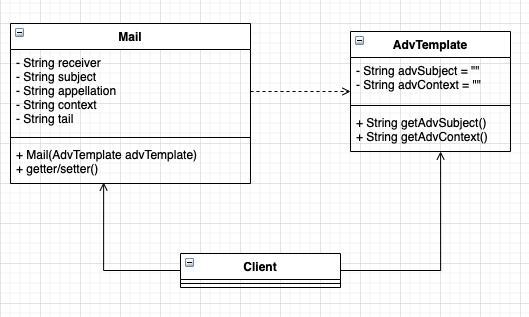

# 原型模式


## 个性化电子账单


现在电子账单越来越流行了，比如你的信用卡，每到月初的时候银行就会发一份电子邮件给你，说你这个月消费了多少，什么时候消费的，积分是多少等，这是每个月发一次。还有一种也是银行发的邮件你肯定非常有印象：广告信，现在各大银行的信用卡部门都在拉拢客户，电子邮件是一种廉价、快捷的通信方式，你用纸质的广告信那个费用太高了，比如我行今天退出一个信用卡刷卡抽奖活动，通过电子账单系统可以一个晚上发送给 600 万客户，为什么要用电子账单系统呢？直接找个发垃圾邮件的工具不就解决问题了吗？是个好主意，但是这个方案在金融行业是行不通的，为什么？因为银行发送该类邮件是有要求的：

- 个性化服务

一般银行都要求个性化服务，发过去的邮件上总有一些个人信息吧，比如 “xx 先生”，“xx 女士”等。

- 递送成功率

邮件的递送成功率有一定的要求，优于大批量地发送邮件会被接收方邮件服务器误认是垃圾邮件，因此在邮件头要增加一些伪造数据，以规避被反垃圾邮件引擎误认为是垃圾邮件。


从这两方面考虑广告信的发送也是电子账单系统（电子账单系统一般包括：账单分析、账单生成器、广告信管理、发送队列管理、发送机、退信处理、报表管理等）的一个子功能，我们今天就来考虑一下广告信这个模块是怎么开发的。那既然是广告信，肯定需要一个模板，然后再从数据库中把客户的信息一个一个地取出，放到模板中生成一份完整的邮件，然后扔给发送机进行发送处理，类图如下：




在类图中 `AdvTemplate` 是广告信的模板，一般都是从数据库取出，生成一个 **BO** 或者 **DTO** ，我们这里使用一个静态的值来作代表；`Mail` 类是一封邮件类，发送机发送的就是这个类，我们先来看 `AdvTemplate` ，代码如下：

- 广告信模板代码

```typescript
class AdvTemplate {
  // 广告信名称
  private advSubject: string = 'XX银行清明节信用卡抽奖活动';

  // 广告信内容
  private advContext: string = '清明节抽奖活动通知: 只要刷卡就送你 100 达不溜';

  // 取得公告信名称
  public getAdvSubject(): string {
    return this.advSubject;
  }

  // 取得广告信内容
  public getAdvContext(): string {
    return this.advContext;
  }
}
```

- 邮件类代码

```typescript
class Mail {
  // 收件人
  private _receiver: string;

  // 邮件名称
  private _subject: string;

  // 称谓
  private _appellation: string;

  // 邮件内容
  private _context: string;

  // 邮件的尾部,一般都是加上"XXX 版权所有"等信息
  private _tail: string;

  constructor(advTemplate: AdvTemplate) {
    this._context = advTemplate.getAdvContext();
    this._subject = advTemplate.getAdvSubject();
  }


  get receiver(): string {
    return this._receiver;
  }

  set receiver(value: string) {
    this._receiver = value;
  }

  get subject(): string {
    return this._subject;
  }

  set subject(value: string) {
    this._subject = value;
  }

  get appellation(): string {
    return this._appellation;
  }

  set appellation(value: string) {
    this._appellation = value;
  }

  get context(): string {
    return this._context;
  }

  set context(value: string) {
    this._context = value;
  }

  get tail(): string {
    return this._tail;
  }

  set tail(value: string) {
    this._tail = value;
  }
}
```


`Mail` 类就是一个业务对象，虽然比较长，还是比较简单的。我们再来看业务场景类是如何对邮件继续处理的：

- 场景类

```typescript
class Client {
  // 发送账单的数量,这个值是从数据库中获得
  private static MAX_COUNT: number = 6;
  static main(): void {
    // 模拟发送邮件
    let i: number = 0;
    // 把模板定义出来,这个是从数据库中获得
    const mail = new Mail(new AdvTemplate());
    mail.tail = 'XX 银行版权所有';
    while (i < this.MAX_COUNT) {
      // 以下是每封邮件不同的地方
      mail.appellation = `${generateRandomString(5)} 先生(女士)`
      mail.receiver = `${generateRandomString(5)}@${generateRandomString(8)}.com`;
      // 然后发送邮件
      sendMail(mail);
      i++;
    }
  }
}

function sendMail(mail: Mail) {
  console.log(`标题: ${mail.subject} \t 收件人: ${mail.receiver} \t ...发送成功`);
}

Client.main();
```

运行结果如下:

```
标题: XX银行清明节信用卡抽奖活动 	 收件人: ZLgRC@sf0RqmTs.com 	 ...发送成功
标题: XX银行清明节信用卡抽奖活动 	 收件人: Ftj66@8PHkrTNw.com 	 ...发送成功
标题: XX银行清明节信用卡抽奖活动 	 收件人: pNhvE@ctRLIp8r.com 	 ...发送成功
标题: XX银行清明节信用卡抽奖活动 	 收件人: DFlBG@hgO4Rco9.com 	 ...发送成功
标题: XX银行清明节信用卡抽奖活动 	 收件人: aVTaB@CWHS0CBn.com 	 ...发送成功
标题: XX银行清明节信用卡抽奖活动 	 收件人: IxfaQ@GJ2K9iZ1.com 	 ...发送成功
```

由于是随机数，每次运行都有差异，不管怎么样，我们这个电子账单发送程序是编写出来了，也能正常发送。我们再来子系地想想，这个程序是否有问题？ 这是一个线程在运行，也就是你发送的是单线程的，那按照一封邮件发出去需要 0.02 秒（够小了，你还要到数据库中取数据呢），600 万封邮件需要 33 个小时，也就是一个整天都发送不完，今天的没发送完，明天的账单又产生了，日积月累，激起甲方人员一堆抱怨，那怎么办？

好办，把 `sendMail` 修改为多线程，但是只把 `sendMail` 修改为多线程还是有问题的，产生第一封邮件对象，放到线程 1 中运行，还没有发送出去；线程 2 也启动了，直接就把邮件对象 mail 的收件人信息改掉了，线程不安全了。说到这里，你会说这有 N 多种解决办法，其中一种是使用一种新型模式来解决问题：通过对象的复制功能来解决这个问题，类图稍作修改。

说到这里，由于我们都用的 *JavaScript* 或者 *TypeScript* ，都是单线程的，上面说的多线程可能有点绕，我这里先画一个简单的流程图，可能不太严谨，仅作方便理解：

 

以下类图稍作修改：


增加了一个 `Cloneable` 接口（Java 自带一个接口，TypeScript 我们借用现有的原生方法）

> 对于ES5，提供Object.create()方法创建一个新对象，使用现有的对象来提供新创建的对象的 __ proto __

> 对于ES6，提供Object.setPrototypeOf()方法设置一个指定的对象的原型(即,内部[Prototype]属性)到另一个对象或 null。

```typescript
interface Cloneable<T> {
  clone(): T
}

class Mail implements Cloneable<Mail>{
  // 收件人
  private _receiver: string;

  // 邮件名称
  private _subject: string;

  // 称谓
  private _appellation: string;

  // 邮件内容
  private _context: string;

  // 邮件的尾部,一般都是加上"XXX 版权所有"等信息
  private _tail: string;

  constructor(advTemplate: AdvTemplate) {
    this._context = advTemplate.getAdvContext();
    this._subject = advTemplate.getAdvSubject();
  }


  clone(): Mail {
    let mail: Mail = null;
    // es5
    mail = Object.create(this)
    // es6
    // let mail = {};
    // mail = Object.setPrototypeOf(mail, this);
    return mail;
  }


  get receiver(): string {
    return this._receiver;
  }

  set receiver(value: string) {
    this._receiver = value;
  }

  get subject(): string {
    return this._subject;
  }

  set subject(value: string) {
    this._subject = value;
  }

  get appellation(): string {
    return this._appellation;
  }

  set appellation(value: string) {
    this._appellation = value;
  }

  get context(): string {
    return this._context;
  }

  set context(value: string) {
    this._context = value;
  }

  get tail(): string {
    return this._tail;
  }

  set tail(value: string) {
    this._tail = value;
  }
}
```

注意看 `Mail` 实现了一个接口，然后场景类也需要稍作修改：

- 修改后的场景类

```typescript
class Client {
  // 发送账单的数量,这个值是从数据库中获得
  private static MAX_COUNT: number = 6;
  static main(): void {
    // 模拟发送邮件
    let i: number = 0;
    // 把模板定义出来,这个是从数据库中获得
    const mail = new Mail(new AdvTemplate());
    mail.tail = 'XX 银行版权所有';
    while (i < this.MAX_COUNT) {
      // 以下是每封邮件不同的地方
      const cloneMail = mail.clone();
      cloneMail.appellation = `${generateRandomString(5)} 先生(女士)`
      cloneMail.receiver = `${generateRandomString(5)}@${generateRandomString(8)}.com`;
      // 然后发送邮件
      sendMail(cloneMail);
      i++;
    }
  }
}
```

运行结果不变，一样完成了电子广告信的发送功能，而且 `sendMail` 即使是多线程也没有关系。注意，`Client` 中的 `mail.clone()` 这个方法，把对象复制一份，产生一个新对象，和原有对象一样，然后再修改细节的数据，如设置称谓、设置收件人地址等。这种不通过 **new** 关键字来产生一个对象，而是通过对象复制来实现的模式就叫做原型模式。


## 原型模式的定义

原型模式（Prototype Pattern）的简单程度仅次于单例模式和迭代器模式。正是由于简单，使用场景才非常地多，其定义如下：

**Specify the kinds of objects to create using a prototypical instance，and create new objects by coping this prototype. （用原型实例指定创建对象的种类，并且通过拷贝这些原型创建新的对象。）**

原型模式的通用类图：


## 原型模式的应用


### 原型模式的优点（基于 TypeScript）

- 方便对象的复制和创建

原型模式可以在运行时动态地复制对象，并且不需要知道对象的具体类型，只需要通过原型对象进行复制即可，从而提高了对象的创建效率。

- 方便实现对象的变体

原型模式可以通过改变原型对象的属性和方法来实现对象的变体，从而避免了在代码中创建大量的子类，使得代码更加简洁和易于维护。

- 实现动态继承

原型模式中，新对象可以动态地继承原型对象的属性和方法，从而使得对象的继承更加灵活。

- 提高性能

由于原型模式在创建对象时不需要调用构造函数，因此可以提高对象创建的性能。


### 原型模式的使用场景

- 资源优化场景

类初始化需要消化非常多的资源，这个资源包括数据，硬件资源等。

- 性能和安全要求的场景

通过 **new** 产生一个对象需要非常繁琐的数据准备或访问权限，则可以使用原型模式。

- 一个对象对多个修改者的场景

一个对象需要提供给其他对象访问，而且各个调用者可能都需要修改其值时，可以考虑使用原型模式拷贝多个对象供调用者使用。


在实际项目中，原型模式很少单独出现，一般是和工厂方法模式一起出现，通过 `clone` 的方法创建一个对象，然后由工厂方法提供给调用者。与java、C#这样以类为中心的编程语言不同，javascript是基于原型的面向对象编程语言，其根本就是原型和原型链。

#### 原型

原型（prototype）：每一个对象都包含一个原型属性，用于关联另一个对象，关联后就能使用那个对象的属性和方法，这其实就是JavaScript的原型式继承。对象字面量的原型是Object.prototype;如果使用new创建的对象，那么它的原型是构造函数的prototype的属性值。除了null、Object.prototype等少数几个没有原型的对象之外，大部分都具有原型，并且是一个继承自Object.prototype的原型。

#### 原型链

每一个对象都包含一个原型属性，用于关联另一个对象，关联后就能够使用那个对象的属性和方法；对象之间通过原型关联到一起，就好比用一条锁链将一个个对象连接在一起，在与各个对象挂钩后，最终形成了一条原型链。


### 原型模式的注意事项

原型模式虽然简单，但是在 TypeScript 中使用还是有一些注意事项的，我们通过几个例子逐个解说。

#### 构造函数不会被执行

一个实现了 `clone` 方法的类 *A*，一个无参构造函数或有参构造 *B*，通过 **new** 关键字产生了一个对象 *S* ，再然后通过 *S.clone()* 方式产生了一个新的对象 *T*，那么在对象拷贝时构造函数 *B* 是不会被执行的。我们来写一小段程序说明这个问题：

- 简单的可拷贝对象

```typescript
interface Cloneable<T> {
  clone(): T;
}
class Thing implements Cloneable<Thing> {
  constructor() {
    console.log(`构造函数执行了...`);
  }
  clone(): Thing {
    return Object.create(this);
  }
}
```

然后我们再来写一个 Client 类，进行对象的拷贝

- 简单的场景类

```typescript
class Client {
  static main(): void {
    // 产生一个对象
    const thing: Thing = new Thing();
    // 拷贝一个对象
    const cloneThing = thing.clone();
  }
}

Client.main();
```

运行结果如下：

```
构造函数执行了...
```

对象拷贝时构造函数确实没有被执行，这点从原理来讲也是可以讲得通的，当使用 `Object.create()` 方法创建一个新对象时，该方法会创建一个空对象，并将指定的对象作为新对象的原型。这意味着新对象会继承原型对象的所有属性和方法。在 JavaScript 中，对象之间的属性和方法的继承是通过原型链来实现的，即每个对象都有一个内部链接到其原型对象的 [[Prototype]] 属性。

#### 浅拷贝和深拷贝

- 浅拷贝（Shallow Copy）

指的是将原始对象的属性值复制到新对象中，但是如果原始对象属性值是引用类型，则新对象中对应的属性值也会是一个引用，指向同一个对象。

> `Object.create` 方法是浅拷贝，因为它只拷贝原型对象的引用，而不是递归地拷贝原型对象中的所有属性和方法。

```typescript
let obj1 = { a: 1, b: { c: 2 } };
let obj2 = { ...obj1 };
obj2.a = 3;
obj2.b.c = 4;

console.log(obj1); // { a: 1, b: { c: 4 } }
console.log(obj2); // { a: 3, b: { c: 4 } }
```

在上面的代码中，我们使用对象展开运算符 `...` 对 `obj1` 进行浅拷贝，得到了一个新对象 `obj2`。然后我们分别修改了 `obj2` 的属性 `a` 和 `b.c`，结果发现 `obj1` 的属性 `b.c` 也发生了改变，这是因为 `obj2.b` 和 `obj1.b` 指向了同一个对象。

- 深拷贝（Deep Copy）

则是将原始对象的所有属性都复制到新对象中，包括引用类型的属性。这样，新对象中对应的属性值会是一个新的对象，与原始对象中对应的属性值完全独立，不会相互影响。

```typescript
function deepCopy(obj: any): any {
  let newObj = Array.isArray(obj) ? [] : {};
  for (let key in obj) {
    if (obj.hasOwnProperty(key)) {
      newObj[key] = typeof obj[key] === 'object' ? deepCopy(obj[key]) : obj[key];
    }
  }
  return newObj;
}

let obj1 = { a: 1, b: { c: 2 } };
let obj2 = deepCopy(obj1);
obj2.a = 3;
obj2.b.c = 4;

console.log(obj1); // { a: 1, b: { c: 2 } }
console.log(obj2); // { a: 3, b: { c: 4 } }
```

在上面的代码中，我们使用递归函数 `deepCopy` 对 `obj1` 进行深拷贝，得到了一个新对象 `obj2`。然后我们分别修改了 `obj2` 的属性 `a` 和 `b.c`，结果发现 `obj1` 的属性值没有改变，这是因为 `obj2.b` 和 `obj1.b` 分别指向了不同的对象。

需要注意的是，深拷贝可能会比浅拷贝耗费更多的时间和内存，因为它需要递归地复制对象的所有属性。因此，在实际应用中，需要根据具体情况来选择合适的拷贝方式。

#### 成员变量（私有变量）

在 TypeScript 中，私有变量通常使用 TypeScript 中的私有属性（Private Field）来实现。私有属性是 TypeScript 3.8 中引入的一项新特性，它可以让开发者在类中定义私有的实例属性，只有类中的方法才能访问这些属性。

当拷贝一个包含私有属性的对象时，无论是浅拷贝还是深拷贝，都只会拷贝到对象中的公共属性和方法，而私有属性是不可访问的。因此，私有属性不会被拷贝，也就不存在深拷贝或浅拷贝的问题。

```typescript
class Person {
  private _name: string;
  public age: number;

  constructor(name: string, age: number) {
    this._name = name;
    this.age = age;
  }

  public getName() {
    return this._name;
  }
}

let p1 = new Person('Tom', 20);
let p2 = { ...p1 };
console.log(p2.age); // 20
console.log(p2.getName()); // Error: Property '_name' is private
```

在上面的代码中，我们定义了一个 `Person` 类，包含一个私有属性 `_name` 和一个公共属性 `age`，并且定义了一个公共方法 `getName()` 来获取私有属性 `_name` 的值。然后我们创建了一个 `Person` 类的实例 `p1`，并将其拷贝到一个新对象 `p2` 中，得到了一个浅拷贝的结果。最后，我们分别输出了 `p2` 的公共属性 `age` 和调用 `p2.getName()` 方法来访问私有属性 `_name`，结果发现访问私有属性时会抛出错误，因为私有属性无法被访问。

因此，无论是深拷贝还是浅拷贝，私有属性都不会被拷贝，只有公共属性和方法会被拷贝到新对象中。

## 小结

原生模式现生产出一个包含大量共有信息的类，然后可以拷贝出副本，修正细节信息，建立了一个完整的个性对象。不知道大家有没有看过施瓦辛格演的《第六日》这部电影，电影的主线也就是一个人被赋值，然后正本和副本对掐。原型模式也就是由一个正本可以创建多个副本的概念。可以这样理解：一个对象的产生可以不由零起步，直接从一个已经具备一定雏形的对象克隆，然后再修改为生产需要的对象。也就是说，生产一个人，可以不从 1 岁长到 2 岁，再到 3 岁...也可以直接找一个人，从其身上获得 DNA ，然后克隆一个人，直接修改一下就是 30 岁了！我们讲的原型模式也就是这样一个功能。
