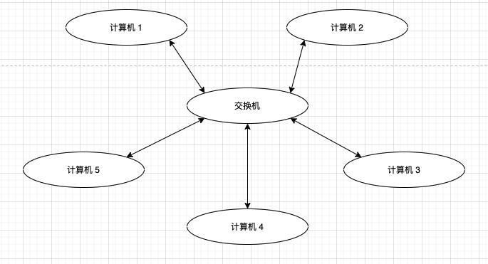

# 中介者模式


## 进销存管理是这个样子的吗

大家都来自五湖四海，都要生存，于是都找到了个靠山——公司，就是给你发薪水的地方。公司要想尽办法盈利赚钱，盈利方法则不尽相同，但是各个公司都有相同的三个环节：采购、销售和库存。这个怎么说呢？比如我司，要开发软件，就需要购买开发环境，如云服务器、物理机、域名、代码托管等，这就是采购；开发完产品还要把产品推销出去；有产品就必然有库存，软件产品也有库存，虽然不需要占用库房空间，但也要占用硬盘，这也是库存。再比如做咨询服务的公司，它要采购什么？采购只是，采购经验，这是这类企业的生存之本，销售的也是只是和经验，库存同样是知识和经验。既然进销存是如此重要，我们今天来讲讲它的原理和设计，我相信很多人都已经开发过这种类型的软件，基本上都形成了固定套路，不管是单机版还是网络版，一般的做法都是通过数据库来完成相关产品的管理，相对来说这还是比较简单的项目，三个模块的示意如图：


我们从这个示意图上可以看出，三个模块是相互依赖的。我们就以一个终端销售商（以服务最终客户为目标的企业，比如某某超市，某某商店等）为例，采购部门要采购 **四鹿奶粉（以下简称‘奶粉’）** ，它根据一下两个要素来决定采购数量。

- 销售情况

销售部门要反馈销售情况，畅销就多采购，滞销就不采购。

- 库存情况

即使是畅销产品，库存都有 1000 桶了，每天才卖出去 10 桶，也就不需要再采购了！

销售模块是企业的盈利核心，对其他两个模块也有影响：

1. 库存情况

库存有货，才能销售，空手套白狼是不行的（除了某夕夕）。

2. 督促采购

在特殊情况下，比如一个企业客户要一次性购买 100 桶作为年终福利，库存只有 80 桶，这是需要催促采购部门赶快采购！

同样地，库存管理也对其他两个模块有影响。库方式有容积限制的，不可能无限大，所以就有了清仓处理，那就要求采购部门停止采购，同时销售部门进行打折销售。

从以上分析来看，这三个模块都有自己的行为，并且与其他模块之间的行为产生关联，类似于我们办公室的同事，大家各干各的活，但是彼此之间还是有交叉的，于是彼此之间就产生紧耦合，也就是一个团队。我们先来实现这个进销存，类图如图。


**Purchase** 负责采购管理，**buyMilkPowder** 指定了采购奶粉 ，**refuseBuyMilkPowder** 是指不再采购奶粉了。

```typescript
class Purchase {
  // 采购奶粉
  buyMilkPowder(num: number): void {
    // 访问库存
    const stock: Stock = new Stock();
    // 访问销售
    const sale: Sale = new Sale();
    // 奶粉销售情况
    const saleStatus: number = sale.getSaleStatus();
    if (saleStatus > 80) { // 销售情况良好
      console.log(`销售状况良好`)
      console.log(`采购奶粉 ${num} 桶`);
      stock.increase(num);
    } else { // 销售情况不好
      console.log(`销售状况不好`)
      // 折半采购(数量位 1,这样不会出现小数)
      const buyNumber: number = num >> 1;
      console.log(`采购奶粉 ${buyNumber} 桶`)
      stock.increase(buyNumber);
    }
  }

  // 不再采购
  refuseBuyMilkPowder(): void {
    console.log(`不再采购奶粉`);
  }
}
```

**Parchase** 定义了采购奶粉的标准：如果销售情况比较好，大于 80 分，你让我采购多少我就采购多少；销售情况不好，你让我采购 100 桶，我就采购 50 桶，对折采购。奶粉采购完毕，需要放到库房中，因此要调用库存的方法，增加库存奶粉数量。我们继续看库房 **Stock** 类：

````typescript
class Stock {
  // 刚开始有 100 桶奶粉
  private static MILK_POWDER_NUMBER: number = 100;

  // 库存增加
  increase(num: number): void {
    Stock.MILK_POWDER_NUMBER = Stock.MILK_POWDER_NUMBER + num;
    console.log(`库存数量为: ${Stock.MILK_POWDER_NUMBER}`);
  }

  // 库存降低
  decrease(num: number): void {
    Stock.MILK_POWDER_NUMBER = Stock.MILK_POWDER_NUMBER - num;
    console.log(`库存数量为: ${Stock.MILK_POWDER_NUMBER}`);
  }

  // 获取库存数量
  getStockNumber(): number {
    return Stock.MILK_POWDER_NUMBER;
  }

  // 库存压力大了,就要通知采购人员不要采购了,销售人员尽快销售
  clearStock() {
    const purchase: Purchase = new Purchase();
    const sale: Sale = new Sale();
    console.log(`清理存货数量为 ${Stock.MILK_POWDER_NUMBER}`);
    // 要求这家销售
    sale.offSale();
    // 要求采购人员不要采购
    purchase.refuseBuyMilkPowder();
  }
}
````


库房中的货物数量肯定有增减，同时库房还有一个容量显示，打到一定的容量后就要求对一些商品进行折价处理，以腾出更多的控件容纳新产品。于是就有了 `clearStock` 方法，既然是清仓处理肯定就要折价销售了。于是在 **Sale** 类中就有了 `offSale` 方法，我们来看 **Sale** 代码：

````typescript
class Sale {
  // 销售奶粉
  sellMilkPowder(num: number): void {
    console.log(`销售出单 ${num} 桶`);
    // 访问库存
    const stock: Stock = new Stock();
    // 访问采购
    const purchase: Purchase = new Purchase();
    // 库存数量不够销售
    if (stock.getStockNumber() < num) {
      console.log(`库存不够,继续采购`);
      purchase.buyMilkPowder(num);
    }
    console.log(`销售奶粉 ${num} 桶`);
    stock.decrease(num);
  }

  // 反馈销售情况, 0 ~ 100 之间变化,0 代表根本就没人买,100 代表非常畅销,出一个卖一个
  getSaleStatus(): number {
    const saleStatus: number = getRandomNumberInRange(0, 100);
    console.log(`奶粉的销售情况为: ${saleStatus}`);
    return saleStatus;
  }

  // 折价处理
  offSale() {
    // 库存有多少卖多少
    const stock: Stock = new Stock();
    console.log(`折价销售奶粉 ${stock.getStockNumber()} 桶`)
  }
}
````


**Sale** 类中的 `getSaleStatus` 是获得销售情况，这个当然要出现在 **Sale** 类中了。销售情况只有销售人员才能反馈出来，通过百分制的机制来衡量销售情况。我们再来看场景类怎么运行的

```typescript
class Client {
  static main() {
    // 采购人员采购奶粉
    console.log(`------------采购人员采购奶粉-----------`);
    const purchase: Purchase = new Purchase();
    purchase.buyMilkPowder(100);
    // 销售人员销售奶粉
    console.log(`------------销售人员销售奶粉-----------`);
    const sale: Sale = new Sale();
    const saleNumber: number = getRandomNumberInRange(0, 200);
    sale.sellMilkPowder(saleNumber);
    // 库房管理人员管理库存
    console.log(`------------库房管理人员清库处理-----------`);
    const stock: Stock = new Stock();
    stock.clearStock();
  }
}

Client.main();
```

我们在场景类中模拟了三种人员的活动：采购人员采购奶粉，销售人员销售奶粉，库管员管理库存。运行结果如下：

```
------------采购人员采购奶粉-----------
奶粉的销售情况为: 41
销售状况不好
采购奶粉 50 桶
库存数量为: 150
------------销售人员销售奶粉-----------
销售出单 158 桶
库存不够,继续采购
奶粉的销售情况为: 26
销售状况不好
采购奶粉 79 桶
库存数量为: 229
销售奶粉 158 桶
库存数量为: 71
------------库房管理人员清库处理-----------
清理存货数量为 71
折价销售奶粉 71 桶
不再采购奶粉
```

运行结果也是我们期望的，三个不同类型的参与者完成了各自的活动。你有没有发现这三个类是彼此关联的？每个类都与其他两个类产生了关联关系。*迪米特法则* 认为“每个类只和朋友类交流”，这个朋友类并非越多越好，朋友类越多，耦合性越大，要想修改一个就得修改一片，这不是面向对象设计所期望的，况且这还是仅三个模块的情况，属于比较简单的一个小项目，我们把进销存扩展一下，如图：


这是一个蜘蛛网的结构，别说是编写程序了，就是给人看估计也能让一大批人昏倒！每个对象都需要和其他几个对象交流，对象越多，每个对象要交流的成本也就越大了，只是维护这些对象的交流就能让一大批程序员望而却步！从这方面来说，我们已经发现设计的缺陷了，当然，我们发现缺陷就要想办法修改。

大家都学过网络的基本知识，网络拓扑有三种类型：总线型、环型、星型。星型网络拓扑如图：



在星型网络拓扑中，每个计算机通过交换机和其他计算机进行数据交换，各个计算机之间并没有直接出现交互的情况。这种结构简单，而且稳定，只要中间那个交换机不瘫痪，整个网络就不会发生大的故障。公司和网吧一般都采用星型网络。我们是不是可以把这种星型结构引入到我们的设计中呢？我们先画一个示意图：


​                                                                                修改后的进销存示意图

加入了一个中介者作为三个模块的交流核心，每个模块之间不再相互交流，要交流就通过中介者进行。每个模块只负责自己的业务逻辑，不属于自己的则丢给中介者来处理，简化了各模块之间的耦合关系：


​                                                                                修改后的进销存类图

建立了两个抽象类 **AbstractMediator** 和 **AbstractColleague** ，每个对象只是与中介者 **Mediator** 之间产生依赖，与其他对象之间没有直接关系， **AbstractMediator** 的作用是实现中介者的抽象定义，定义了一个抽象方法 `execute` ，正如**修改后的进销存示意图**

修改后的代码如下

- 抽象中介者

```typescript
abstract class AbstractMediator {
  protected purchase: Purchase;
  protected sale: Sale;
  protected stock: Stock;

  constructor() {
    this.purchase = new Purchase(this);
    this.sale = new Sale(this);
    this.stock = new Stock(this);
  }

  // 中介者最重要的方法叫做事件方法,处理多个对象之间的关系
  public abstract execute(str: string, ...args: any[]): void;
}
```

 再来看具体的中介者，我们可以根据业务的要求产生多个中介者，并划分中介者的职责。

- 具体中介者

```typescript
class Mediator extends AbstractMediator {
  // 中介者最重要的方法
  public execute(str: string, ...args: any[]) {
    if (str === 'purchase.buy') {
      // 采购奶粉
      this.buyMilkPowder(args[0]);
    } else if (str === 'sale.sell') {
      // 销售奶粉
      this.sellMilkPowder(args[0])
    } else if (str === 'sale.offSale') {
      // 折价销售
      this.offSale()
    } else if (str === 'stock.clear') {
      // 清仓处理
      this.clearStock();
    }
  }

  private buyMilkPowder(num: number): void {
    const saleStatus = this.sale.getSaleStatus();
    if (saleStatus > 80) {
      // 销售状况良好
      console.log(`采购奶粉 ${num} 桶`);
      this.stock.increase(num);
    } else {
      // 销售状况不好
      const buyNumber = num >> 1;
      console.log(`采购奶粉 ${buyNumber} 桶`);
      this.stock.increase(buyNumber);
    }
  }

  // 销售奶粉
  private sellMilkPowder(num: number): void {
    if (this.stock.getStockNumber() < num) {
      // 库存数量不够销售
      console.log(`库存不够,继续采购`);
      this.purchase.buyMilkPowder(num);
    }
    this.stock.decrease(num);
  }

  // 折价处理
  private offSale(): void {
    console.log(`折价销售奶粉 ${this.stock.getStockNumber()} 桶`);
  }

  // 清仓
  private clearStock(): void {
    // 要求清仓销售
    this.sale.offSale();
    // 要求采购人员不要采购
    this.purchase.refuseBuyMilkPowder();
  }
}
```

中介者 **Mediator** 定义了多个 *private* 方法，其目的是处理各个对象之间的依赖关系，就是说吧原有一个对象要以来多个对象的情况移到中介者的 *private* 方法中实现。在实际项目中，一般的做法事中介者按照职责进行划分，每个中介者处理一个或多个类似的关联请求。

由于要使用中介者，我们增加了一个抽象同事类，三个具体的实现类分别继承该抽象类。

- 抽象同事类

```typescript
abstract class AbstractColleague {
  protected mediator: AbstractMediator;

  protected constructor(_mediator: AbstractMediator) {
    this.mediator = _mediator;
  }
}
```

- 修改后的采购管理

```typescript
/**
 * 采购管理
 */
class Purchase extends AbstractColleague {
  constructor(_mediator: AbstractMediator) {
    super(_mediator);
  }

  // 采购奶粉
  public buyMilkPowder(num: number): void {
    this.mediator.execute('purchase.buy', num);
  }

  // 不再采购
  refuseBuyMilkPowder(): void {
    console.log(`不再采购奶粉`);
  }
}
```

上述的 **Purchase** 类简化了很多，也清晰了很多，处理自己的职责，与外界有关系的事件处理则交给了中介者来完成。再来看 **Stock** 类

- 修改后的库存管理

```typescript
/**
 * 库存管理
 */
class Stock extends AbstractColleague {
  private static MILK_POWDER_NUMBER: number = 100;

  constructor(_mediator: AbstractMediator) {
    console.log(`初始库存为 : ${Stock.MILK_POWDER_NUMBER}`)
    super(_mediator);
  }

  // 库存增加
  increase(num: number): void {
    Stock.MILK_POWDER_NUMBER = Stock.MILK_POWDER_NUMBER + num;
    console.log(`库存数量为: ${Stock.MILK_POWDER_NUMBER}`);
  }

  // 库存降低
  decrease(num: number): void {
    Stock.MILK_POWDER_NUMBER = Stock.MILK_POWDER_NUMBER - num;
    console.log(`库存数量为: ${Stock.MILK_POWDER_NUMBER}`);
  }

  // 获取库存数量
  getStockNumber(): number {
    return Stock.MILK_POWDER_NUMBER;
  }

  // 库存压力大了,就要通知采购人员不要采购了,销售人员尽快销售
  clearStock() {
    console.log(`清理存货数量为 ${Stock.MILK_POWDER_NUMBER}`);
    this.mediator.execute('stock.clear');
  }
}
```

- 修改后的销售管理

```typescript
/**
 * 销售管理
 */
class Sale extends AbstractColleague {
  constructor(_mediator: AbstractMediator) {
    super(_mediator);
  }

  // 销售奶粉
  sellMilkPowder(num: number): void {
    console.log(`销售奶粉 ${num} 桶`);
    this.mediator.execute('sale.sell', num);
  }

  // 反馈销售情况, 0 ~ 100 之间变化,0 代表根本就没人买,100 代表非常畅销,出一个卖一个
  getSaleStatus(): number {
    const saleStatus: number = getRandomNumberInRange(0, 100);
    console.log(`奶粉的销售情况为: ${saleStatus}, 销售状况 ${saleStatus > 80 ? '良好': '不好'} *注:良好全量采购,不好半量采购`);
    return saleStatus;
  }

  // 折价处理
  offSale() {
    this.mediator.execute('sale.offSale');
  }
}
```

- 修改后的场景类

```typescript
class Client {
  static main() {
    const mediator: AbstractMediator = new Mediator();
    // 采购人员采购奶粉
    console.log(`------------采购人员采购奶粉-----------`);
    const purchase: Purchase = new Purchase(mediator);
    purchase.buyMilkPowder(100);
    // 销售人员销售奶粉
    console.log(`------------销售人员销售奶粉-----------`);
    const sale: Sale = new Sale(mediator);
    const saleNumber: number = getRandomNumberInRange(0, 200);
    sale.sellMilkPowder(saleNumber);
    // 库房管理人员管理库存
    console.log(`------------库房管理人员清库处理-----------`);
    const stock: Stock = new Stock(mediator);
    stock.clearStock();
  }
}
```

场景类中增加了一个中介者，然后分别传递到三个同事类中，三个类都具有相同的特性：只负责处理自己的活动（行为），与自己无关的活动就丢给中介者处理，程序运行的结果是相同的。从项目设计上来看，加入了中介者，设计结构清晰了很多，而且类间的耦合性大大减少，代码质量也有很大的提升。

在多个对象以来的情况下，通过加入中介者角色，取消了多个对象的关联或者依赖关系，减少了对象的耦合性。

- 修改后的运行结果

```shell
------------采购人员采购奶粉-----------
奶粉的销售情况为: 32, 销售状况 不好 *注:良好全量采购,不好半量采购
采购奶粉 50 桶
库存数量为: 150
------------销售人员销售奶粉-----------
销售奶粉 169 桶
库存不够,继续采购
奶粉的销售情况为: 64, 销售状况 不好 *注:良好全量采购,不好半量采购
采购奶粉 84 桶
库存数量为: 234
库存数量为: 65
------------库房管理人员清库处理-----------
清理存货数量为 65
折价销售奶粉 65 桶
不再采购奶粉
```


## 中介者模式的定义

中介者模式的定义为： **Define an object that encapsulates how a set of objects interact. Mediator promotes loose coupling by keeping objects from referring to each other explicitly, and it let's you vary their interaction independently. （用一个中介对象封装一系列的对象交互，中介者使各对象不需要显式地相互作用，从而使其耦合松散，而且可以独立地改变他们之间的交互。）**

中介者模式通用类图如下：


从类图中看，中介者模式由以下几部分组成：

- Mediator 抽象中介者角色

抽象中介者角色定义统一的借口，由于各同事角色之间的通信。

- Concrete Mediator 具体中介者角色

具体中介者角色通过协调各同事角色实现协作行为，因此它必须依赖于各个同事角色。

- Colleague 同事角色

每一个同事角色都知道中介者角色，而且与其他的同事角色通信的时候，一定要通过中介者角色协作。每个同事类的行为分为两种：一种是同事本身的行为，比如改变对象本身的状态，处理自己行为等，这种行为叫做自发行为（**Self-Method**），与其他的同事类或中介者没有任何的依赖；第二种是必须以来中介者才能完成的行为，叫做依赖方法（**Dep-Method**）。

- 通用抽象中介者

```typescript
abstract class Mediator {
  // 定义同事类
  protected _c1: ConcreteColleague1;
  protected _c2: ConcreteColleague2;
  // 通过 getter/setter 方法吧同事类注入进来
  set c1(c1: ConcreteColleague1) {
    this._c1 = c1;
  }

  get c1(): ConcreteColleague1 {
    return this._c1;
  }

  set c2(c2: ConcreteColleague2) {
    this._c2 = c2;
  }

  get c2(): ConcreteColleague2 {
    return this._c2;
  }

  // 中介者模式的业务逻辑
  public abstract doSomething1(): void;
  public abstract doSomething2(): void;
}
```

在 **Mediator** 抽象类中我们只定义了同事类的注入，为什么使用同事实现类注入而不使用抽象类注入呢？那是因为同事类虽然有抽象，但是没有每个同事类必须要完成的业务方法，当然如果每个同事类都有相同的方法，比如 `execute` 、`handler` 等，那当然注入抽象类，做到依赖倒置。

具体的中介者一般只有一个，即通用中介者，器源代码如下：

```typescript
class ConcreteMediator extends Mediator {
  public doSomething1(): void {
    // 调用同事类的方法,只要是 public 方法都可以调用
    this.c1.selfMethod1();
    this.c2.selfMethod2();
  }

  public doSomething2(): void {
    this.c1.selfMethod1();
    this.c2.selfMethod2();
  }
}
```

中介者所具有的方法 `doSomething1` 和 `doSomething2` 都是比较复杂的业务逻辑，为同事类服务，其实现是依赖哥哥同事类来完成的。

-  抽象同事类

```typescript
abstract class Colleague {
  protected mediator: Mediator;

  protected constructor(_mediator: Mediator) {
    this.mediator = _mediator;
  }
}
```

这个基类也非常简单，一般来说，中介者模式中的抽象都比较简单，是为了建立这个中介而服务的，具体同事类如下

- 具体同事类

```typescript
class ConcreteColleague1 extends Colleague {
  // 通过构造函数传递中介者
  constructor(_mediator: Mediator) {
    super(_mediator);
  }

  // 自由方法 self-method
  public selfMethod1(): void {
    // 处理自己的业务逻辑
  }

  // 依赖方法 dep-method
  public depMethod1(): void {
    // 处理自己的业务逻辑
    // 自己不能处理的业务逻辑,委托给中介者处理
    this.mediator.doSomething1();
  }
}

class ConcreteColleague2 extends Colleague {
  // 通过构造函数传递中介者
  constructor(_mediator: Mediator) {
    super(_mediator);
  }

  // 自由方法 self-method
  public selfMethod2(): void {
    // 处理自己的业务逻辑
  }

  // 依赖方法 dep-method
  public depMethod2(): void {
    // 处理自己的业务逻辑
    // 自己不能处理的业务逻辑,委托给中介者处理
    this.mediator.doSomething2();
  }
}

```

为什么同事类要使用构造函数注入中介者，而中介者使用 `getter/setter` 方式注入同事类呢？这是因为同事类必须有中介者，而中介者却可以只有部分同事类。


## 中介者模式的应用

### 中介者模式的优点

中介者模式的优点就是减少类间的依赖，把原有的一对多的依赖便乘了一对一的依赖，同事类只有依赖中介者，减少了依赖，当然同时也降低了类间的耦合。

### 中介者模式的缺点

中介者模式的缺点就是中介者会膨胀得很大，而且逻辑复杂，原本 N 个对象直接的相互依赖关系转换为中介者和同事类的依赖关系，同事类越多，中介者的逻辑就越复杂。

### 中介者模式的使用场景

中介者模式简单，但是简单不代表容易使用，很容易被误用。在面向对象的编程中，对象和对象之间必然会有依赖关系，如果某个类和其他类没有任何相互依赖的关系，那这个类就是一个“孤岛”，在项目中就没有存在的必要了！就像是某个人如果永远独立生活，与任何人都没有关系，那这个人基本上就就算是野人了——排除在人类这个定义之外。

类之间的依赖关系是必然存在的，一个类以来多个类的情况也是存在的，存在即合理，那是否可以说只要多个依赖关系就考虑使用中介者模式呢？答案是否定的。中介者模式未必能帮你把原本凌乱的逻辑整理的清清楚楚，而且中介者模式也是有缺点的，这个缺点在使用不当时会被放大，比如原本就简单的几个对象依赖关系，如果为了使用模式儿加入了中介者，必然导致中介者的逻辑复杂化，因此中介者模式的使用需要“量力而行”！中介者模式适用于多个对象之间紧密耦合的情况，紧密耦合的标准是：在类图中出现了蜘蛛网状结构。在这种情况下一定要考虑中介者模式，这有利于把蜘蛛网梳理为星型结构，使原本复杂混乱的关系变得清晰简单。

## 中介者模式的实际应用

中介者模式也叫作调停者模式，是什么意思呢？一个对象要和 N 多个对象交流，就像对象间的战争，很混乱。这时，需要加入一个中心，所有的类都和中心交流，中心说怎么处理就怎么处理，我们句一些在开发和生活中经常碰到的例子。

- 机场调度中心

大家在每个机场都会看到一个“xx 机场调度中心”，它就是具体的中介者，用来调度每一家要降落和起飞的飞机。比如，某家飞机（同事类）飞到机场上空了，就询问调度中心（中介者）“我是否可以降落”以及“降落到哪个跑到”，调度中心（中介者）查看其他飞机（同事类）的情况，然后通知飞机降落。如果没有机场调度中心，飞机飞到机场了，飞行员需要先看看有没有飞机盒自己一起降落的，有没有空跑道，停机位是否具备等情况，这种局面是难以想像的！

- MVC 框架

大家应该都听说过甚至使用过一些 “MVC 框架” ，比如 Struts，其中的 C（Controller）就是一个中介者，叫做前端控制器（Front Controller），它的作用就是把 M（Model，业务逻辑）和 V（View， 视图）隔离开，协调 M 和 V 协同工作，把 M 运行的结果和 V 代表的视图融合成一个前端可以展示的页面，减少 M 和 V 的依赖关系。MVC 框架也是非常成熟的开发框架，这也是中介者模式的优点的一个体现。

- 媒体网关

媒体网关也是一个典型的中介者模式，比如使用 企鹅、微信时，张三发消息给李四，其过程应该是这样的：张三发送消息，微信服务器（中介者）接收到消息，查找李四，把消息发送到李四，同时通知张三，消息已经发送。在这里，微信服务器就是一个中转站，负责协调两个客户端的信息交流，榆次相反的就是 IPMsg（也叫飞鸽），它没有使用中介者，而直接使用了 **UDP** 广播的方式，每个客户端既是客户端也是服务器。

```typescript
// 中介者接口
interface Mediator {
  sendMessage(message: string, user: User): void;
  addUser(user: User): void;
}

// 具体中介者
class ChatRoom implements Mediator {
  private users: User[] = [];

  addUser(user: User) {
    this.users.push(user);
  }

  sendMessage(message: string, user: User) {
    console.log(`服务端:[${user.getName()}] 发送消息: ${message}`);
    for (const u of this.users) {
      if (u !== user) {
        u.receive(message); // 调用其他用户的接收方法
      }
    }
  }
}

// 用户类
class User {
  private readonly name: string;
  private mediator: Mediator;

  constructor(name: string, mediator: Mediator) {
    this.name = name;
    this.mediator = mediator;
    this.mediator.addUser(this); // 注册用户到中介者
  }

  getName(): string {
    return this.name;
  }

  send(message: string) {
    console.log(`客户端:[${this.name}] 发送消息: ${message}`);
    this.mediator.sendMessage(message, this);
  }

  receive(message: string) {
    console.log(`客户端:[${this.name}] 收到消息: ${message}`);
  }
}

// 创建中介者和用户
const chatRoom = new ChatRoom();
const user1 = new User("User1", chatRoom);
const user2 = new User("User2", chatRoom);

// 用户发送消息
user1.send("你好吗？");
user2.send("我很好，谢谢！");

```


- 中介服务

现在中介服务非常多，比如租房中介、出国中介，这些也都是中介者模式的具体题型，比如你去租房子，如果没有房屋中介，你就必须一个一个小区去找看看有没有空房子，有没有适合自己的房子，找到房子后还要和房东签合约，自己检查房屋的家具、水电、煤气等；有了中介后，你就省心很多了，找中介，然后安排看房子，看中了，签合约，中介帮你检查房屋的水电、煤气等等。这也是中介者模式的实际应用。

## 最佳实践

中介者模式是一个非常好的封装模式，也是一个很容易被滥用的模式，一个对象依赖几个对象是再正常不过的事情，但是纯理论家就会要求使用中介者模式来封装这种依赖关系，这是非常危险的！使用中介者模式就必然会带来中介者的膨胀问题，这在一个项目中是很不恰当的。

大家可以在如下的情况下尝试使用中介者模式：

- N 个对象之间产生了相互的依赖关系（N > 2）
- 多个对象有依赖关系，但是依赖的行为尚不确定或者有发生改变的可能，在这种情况下一般建议采用中介者模式，降低变更引起的风险扩散
- 产品开发。一个明显的例子就是 MVC 框架，把中介者模式应用到产品中，可以提升产品的性能和扩展性，但是对于项目开发就未必，因为项目是以交付投产为目标，而产品则是以稳定、高效、扩展为宗旨。
